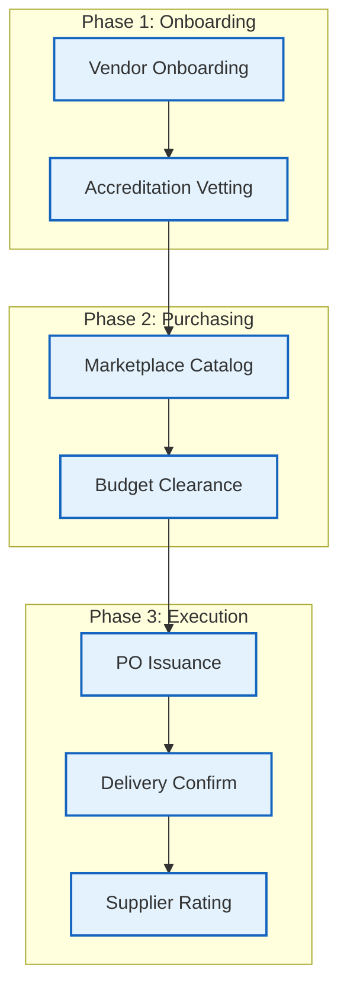
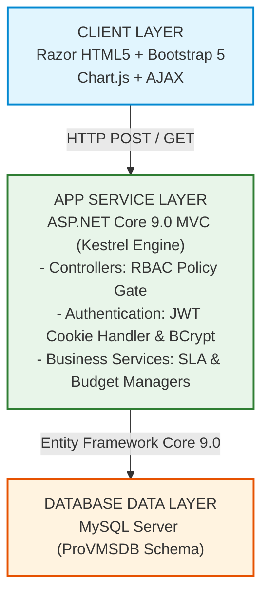
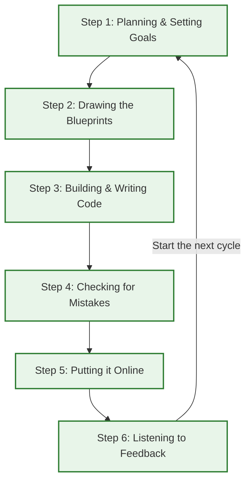
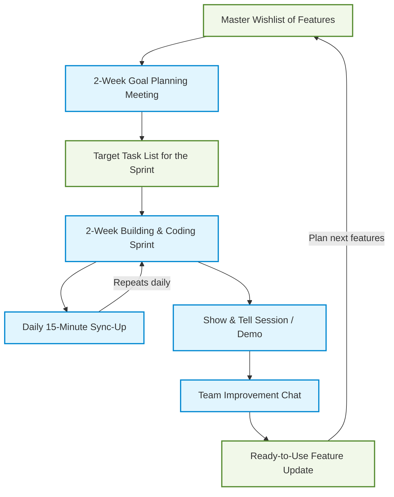
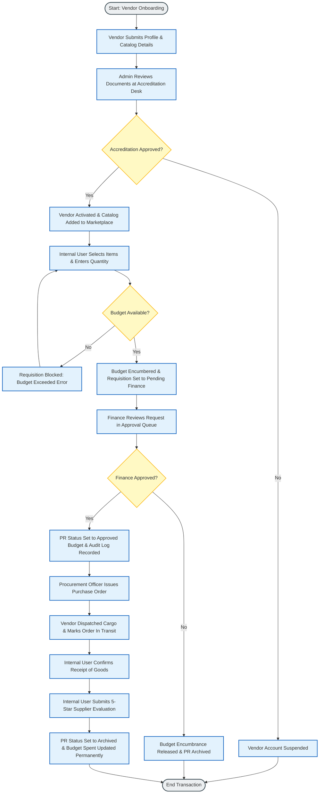
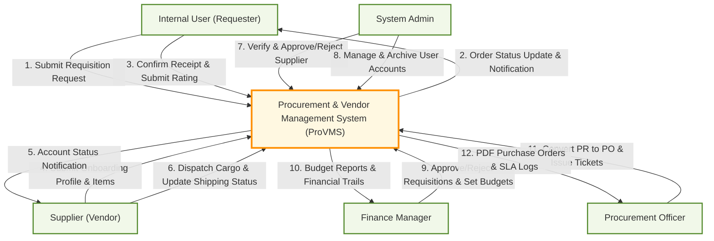
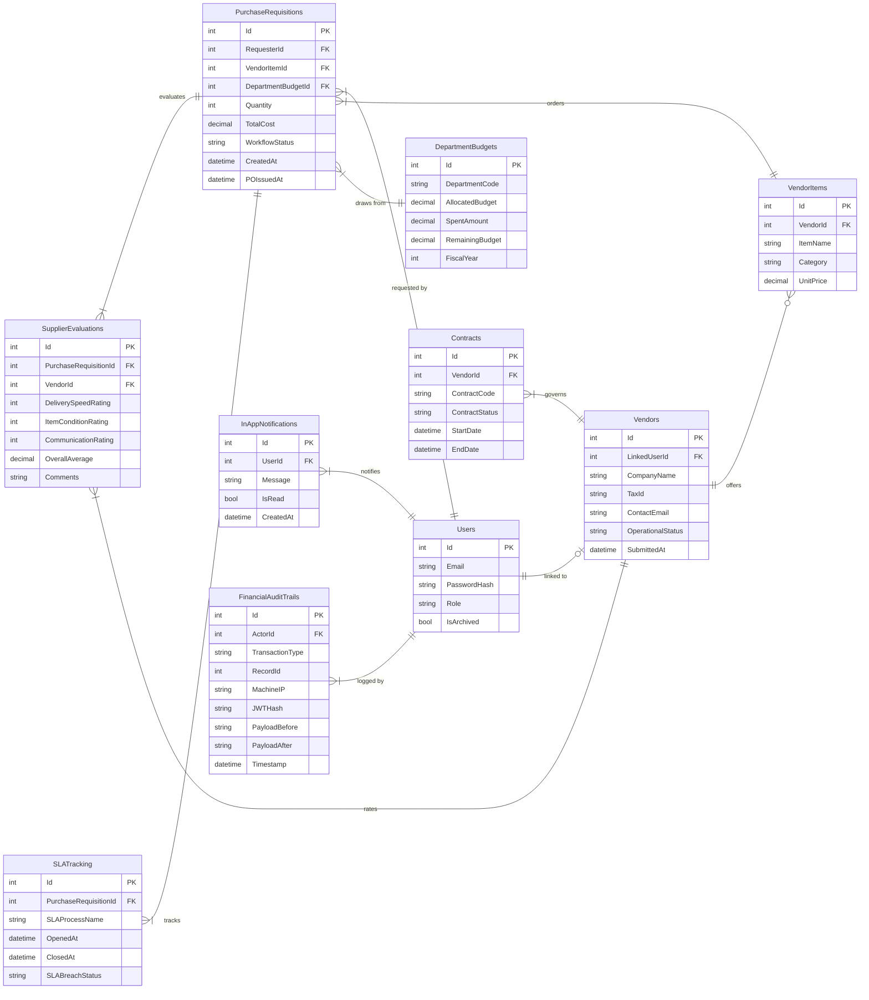
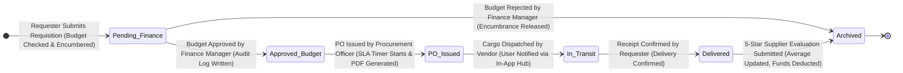
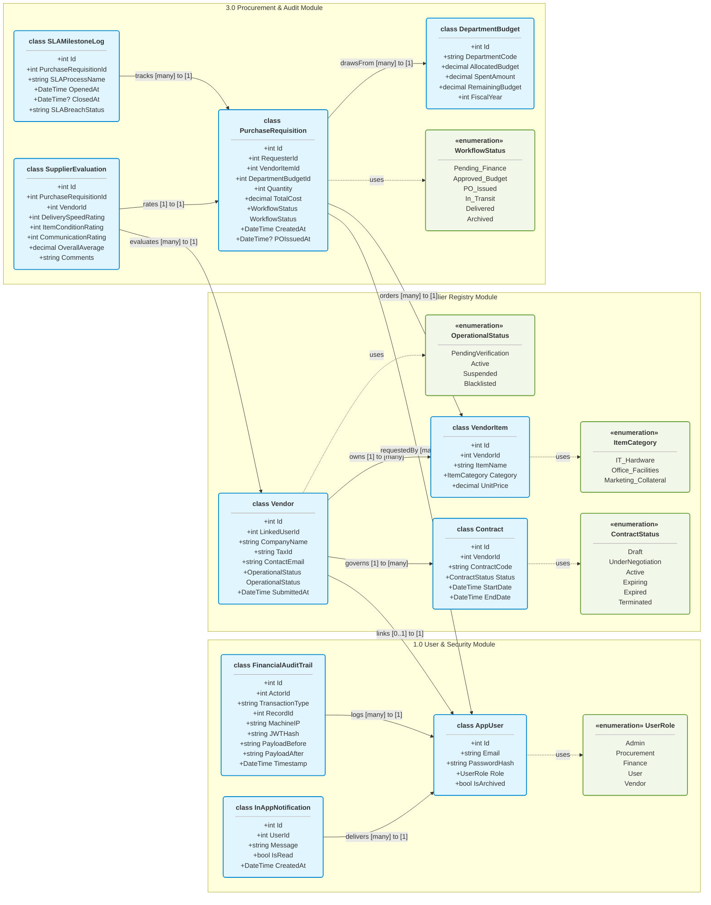
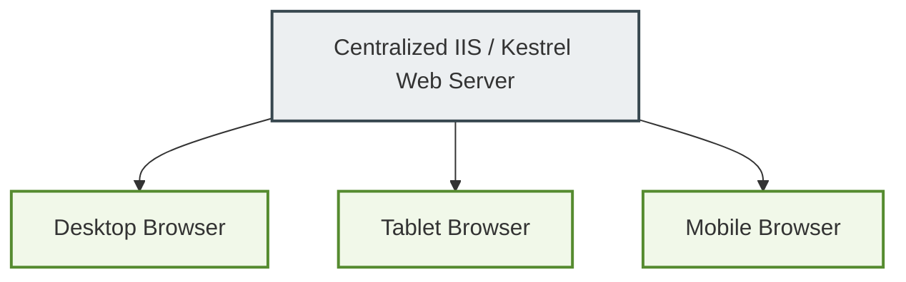

# CCE106/L FIRST LABORATORY EXAM
## Software Requirements Specification (SRS) & System Design
**Project Name:** ProVMS (Procurement & Vendor Management System)  
**Role:** Software Engineer  
**Output:** Software Requirements Specification (SRS) & Development Process Documentation (User-Friendly Version)  

---

> **Note:** This document serves as the official laboratory exam submission for the ProVMS project. It is structured to align directly with the six instructions and the grading rubric. All technical terminology throughout this document is paired with simple, everyday explanations so that non-technical stakeholders and examiners can easily understand how the system works.

---

## PLAIN ENGLISH TERMINOLOGY GUIDE
This reference guide translates the technical terms used in this document into simple, everyday explanations:

| Technical / Enterprise Term | Simplified Term | Everyday Definition (What it actually means) |
| :--- | :--- | :--- |
| **Purchase Requisition (PR)** | **Purchase Request** (or **Order Request**) | An internal request made by an employee asking for permission to buy something. |
| **Purchase Order (PO)** | **Approved Order** (or **Official Order Ticket**) | The formal, legally-binding document sent to the supplier confirming what the company is buying and at what price. |
| **Pre-Encumbrance / Encumbering** | **Budget Locking** (or **Reserving Funds**) | Temporarily freezing department money when a request is made, so it cannot be spent on anything else while waiting for approval. |
| **Hard Budget Ceiling** | **Strict Spending Limit** | A hard system rule that immediately blocks any purchase request if the department does not have enough remaining money to cover it. |
| **Maverick Spending** | **Unapproved Spending** (or **Off-Book Purchases**) | When employees buy goods or services directly from vendors without using the company's approved purchasing portal or budget approvals. |
| **Vendor Accreditation Desk** | **Supplier Vetting Portal** (or **Verification Desk**) | The admin dashboard where new vendor sign-ups and tax certificates are reviewed and approved before they are allowed to do business with the company. |
| **SLA (Service Level Agreement)** | **Expected Response Time** (or **Turnaround Limit**) | The maximum allowed time for a specific task to be finished (e.g., Finance must approve a request within 24 hours). |
| **Append-Only Immutable Audit Trail** | **Permanent Activity Log** (or **Unchangeable Ledger**) | A digital logbook that records every financial change. Once recorded, these entries can never be modified, deleted, or erased. |
| **Soft-Delete / Archiving** | **Deactivating** (or **Hiding** accounts) | Marking a user or record as inactive so they cannot log in or appear on active lists, while keeping their data hidden in the database to preserve historical order history. |
| **RBAC (Role-Based Access Control)** | **Access Permissions** (or **Account Roles**) | Controlling what screens and actions a user can access based on their job title (e.g., only Finance can see budgets, and only Vendors can mark items as dispatched). |
| **Cookie-Based JWT Auth** | **Secure Session Pass** | A digital security token stored in the browser that keeps you logged in securely and proves who you are to the system. |
| **reCAPTCHA verification** | **Human Validation Check** | The security test ("I am not a robot" checkbox) that checks if a login attempt is from a real person or an automated bot. |
| **ORM (Object-Relational Mapper)** | **Database Bridge** | A tool that acts as a translator, allowing the application's C# code to communicate smoothly with the MySQL database without writing complex database commands. |
| **SQL Injection** | **Database Tampering** | A security threat where hackers try to write malicious commands into input fields to steal or destroy database records. |
| **CSRF (Cross-Site Request Forgery)** | **Fake Submission Attack** | A security threat where a malicious website tries to trick a logged-in user into performing actions (like approving a request) without their knowledge. |
| **Agile Scrum Framework** | **Flexible Teamwork Method** | A teamwork approach where the building process is broken down into small, flexible cycles rather than planning the entire project at once. |
| **Sprint** | **2-Week Building Sprint** | A fixed 2-week period where the development team designs, builds, and tests a specific set of features. |
| **Product Backlog** | **Master Wishlist** | An ordered list of all the features, improvements, and fixes that need to be built for the system. |
| **Sprint Planning** | **Goal Planning Meeting** | A meeting held at the start of each 2-week cycle to select which features from the Master Wishlist will be built next. |
| **Daily Standup / Scrum** | **Daily 15-Minute Sync-Up** | A short daily meeting for the builders to share updates, align on the day's tasks, and discuss any roadblocks. |
| **Sprint Review / Demo** | **Show & Tell Session** | A session at the end of a sprint where the team shows the newly built, working features to users and managers for feedback. |
| **Sprint Retrospective** | **Team Improvement Chat** | A post-sprint meeting where the team discusses what went well and how they can improve their working process. |

---

## TABLE OF CONTENTS
1. [1. Software Requirements Specification (SRS)](#1-software-requirements-specification-srs)
   - [Introduction](#introduction)
   - [System Description](#system-description)
   - [Requirements](#requirements)
2. [2. Application Development Process](#2-application-development-process)
   - [Software Development Life Cycle (SDLC)](#software-development-life-cycle-sdlc)
   - [Chosen Development Model (Agile Scrum Framework)](#chosen-development-model-agile-scrum-framework)
   - [Model Justification](#model-justification)
3. [3. Concept Integration (Required Topics)](#3-concept-integration-required-topics)
   - [Emerging Technologies](#emerging-technologies)
   - [Software and Hardware Technologies](#software-and-hardware-technologies)
   - [Multiplatform Development](#multiplatform-development)
   - [Mobile and Web Applications](#mobile-and-web-applications)
   - [Web and Mobile Frameworks](#web-and-mobile-frameworks)
   - [APIs and Their Role in Development](#apis-and-their-role-in-development)
4. [4. Required Diagrams](#4-required-diagrams)
   - [Flowchart](#flowchart)
   - [Data Flow Diagram (DFD)](#data-flow-diagram-dfd)
   - [Entity-Relationship Diagram (ERD)](#entity-relationship-diagram-erd)
   - [State Transition Diagram](#state-transition-diagram)
   - [Class Diagram](#class-diagram)
   - [Screen/UI Design (Mockups or Wireframes)](#screenui-design-mockups-or-wireframes)
5. [5. Application Type](#5-application-type)
6. [6. Documentation Quality](#6-documentation-quality)

---

## 1. Software Requirements Specification (SRS)

### Introduction

#### Project Overview
The **Procurement & Vendor Management System (ProVMS)** is a centralized, web-based, role-governed Enterprise Resource Planning (ERP) subsystem designed to digitize and manage the supplier-to-payment lifecycle. In modern corporate environments, manual purchasing processes are plagued by administrative drag, unapproved spending ("maverick spending"), and lack of transparency. ProVMS addresses these inefficiencies by consolidating vendor onboarding, catalog management, purchase requisition (purchase requests), departmental budget validation, purchase order (official order ticket) generation, shipment tracking, and post-delivery vendor evaluation into a single, cohesive application platform.



#### Purpose of the System
The primary purpose of ProVMS is to establish operational rigor and financial governance over an organization's procurement cycle. Specifically, the system aims to:
1. **Enforce Financial Compliance:** Prevent unauthorized expenditures by checking departmental budgets in real-time, instantly freezing funds upon requisition submission (pre-encumbrance / budget locking), and rejecting over-budget purchases.
2. **Standardize Vendor Accreditation:** Vett external suppliers through a formal administrative desk (vetting portal) to ensure only verified, tax-compliant partners enter the catalog database.
3. **Optimize the Procurement Workflow:** Minimize cycle times from request to delivery by implementing automated workflow transitions and color-coded SLA (Expected Response Time) indicators.
4. **Build Supplier Accountability:** Establish a 5-star evaluation system across delivery speed, condition, and communication, feeding a live supplier leaderboard to guide purchasing decisions.
5. **Ensure Audit Traceability:** Maintain an unchangeable, append-only financial ledger (permanent activity log) capturing every critical transaction state change with cryptographic integrity (tamper-proof security).

#### Target Users & Role Permissions
ProVMS operates on a strict **Zero-Trust Role-Based Access Control (RBAC - Account Access Permissions)** architecture. The system defines five distinct user roles:

| Role | Target User Group | Primary Responsibilities | Access Boundaries |
| :--- | :--- | :--- | :--- |
| **System Admin** | IT / Systems Administrators | System configuration, user provisioning (creating accounts), global system logs review, vendor accreditation (vetting) approvals. | Full read/write access. Excluded only from submitting requests or vendor catalogs. |
| **Finance Manager** | Accounts Payable / CFO Team | Budget allocations, budget clearance approvals, financial audit trails (permanent logs), expenditure reports. | Access to approval queues, budget ledgers, and audit trails. Blocked from procurement dispatch actions. |
| **Procurement Officer** | Purchasing Agents / Buyers | Vendor directory, contract negotiations, converting approved requisitions to Purchase Orders (PO / Official Order Tickets). | Access to PO issuance, contract desks, and shipment logs. Blocked from approving budgets. |
| **Internal User (Requester)**| Department Representatives | Browsing vendor catalogs, submitting Purchase Requisitions (PR / Purchase Requests), confirming material deliveries, and rating suppliers. | Access to the Marketplace, My Requests, and Evaluation Forms. Blocked from administrative and financial settings. |
| **Registered Vendor** | Third-Party Suppliers | Self-onboarding, catalog inventory management, receiving purchase orders, updating cargo shipment status. | Access limited strictly to own company profile, items, and active orders. Forbidden from accessing internal data. |

---

### System Description

#### Scope of the Application
ProVMS manages the transactional lifecycle beginning at supplier registration and ending at final evaluation archiving (soft-deleting). The scope is bounded by the following functional modules:
*   **Vendor Accreditation Desk (Supplier Vetting Portal):** A public onboarding wizard that takes company information and tax PDFs, paired with an admin review panel that activates or suspends vendor accounts.
*   **Central Marketplace:** A secure marketplace where internal employees can browse approved vendor products and request purchases.
*   **Budget Governance Engine:** A real-time calculator that validates budget availability, registers pre-encumbrances (budget locking) to prevent double-spending, and enforces a hard ceiling (strict spending limit) on department spending.
*   **PO Generation & Vault:** An automated generator that outputs official Purchase Orders (PO / Order Tickets) as immutable (unchangeable) PDF sheets (built using the `iText7` library).
*   **Delivery & SLA Tracker:** A tracker displaying shipment progress and calculating elapsed time against internal SLAs / Turnaround Limits (24 hours for Finance, 48 hours for Admin, 72 hours for Vendor).
*   **Supplier Performance Desk:** A feedback portal that processes 3-axis quality evaluations and populates a relative-scoring vendor leaderboard.

*Out of Scope:* The system does *not* handle automated electronic payments (bank transfers), warehousing/inventory level tracking post-receipt, or customer-facing sales pipelines (CRM).

#### Features and Functionalities
1.  **Secure Authentication Gate (Secure Login):** Utilizes cookie-based JWT sessions (secure session passes), BCrypt password hashing, and Google reCAPTCHA v2 (human validation checks) to defend against automated brute-force attacks and session hijacking.
2.  **Interactive Dashboard:** Displays critical Key Performance Indicators (KPIs / system stats) and data charts (rendered via `Chart.js`) illustrating budget consumption, active suppliers, and rating trends.
3.  **Real-Time Budget Validation:** Checks remaining budget and blocks submissions immediately with `HTTP 400` if a transaction exceeds department limits by even Php 1.00.
4.  **CFO Immutability Protection:** Blocks hard deletion on audit tables, contract records, and purchase requisitions at the `DbContext` (database controller) layer, converting deletions to structured `Archived` soft-states (deactivated/hidden records).
5.  **In-App Notification Bell Hub:** Alerts users in real-time regarding state changes (e.g., Finance approving a request, a vendor marking a shipment as dispatched).

#### Technology Stack
The application is designed using a robust, enterprise-grade architecture:



*   **Software Technology Stack:**
    *   **Backend Framework:** ASP.NET Core 9.0 MVC (Model-View-Controller pattern)
    *   **Object-Relational Mapper (ORM / Database Bridge):** Entity Framework Core (EF Core) via Pomelo MySQL provider
    *   **Database Engine:** MySQL Database Server (relational schema)
    *   **Security & Encryption:** BCrypt.Net-Next (password hashing, work factor 11), JWT (JSON Web Tokens / secure session passes)
    *   **PDF Compiler:** iText7 PDF Generation Engine
    *   **Frontend UI Framework:** Bootstrap 5 (responsive styling), Bootstrap Icons
    *   **Visual Analytics:** Chart.js 4.4.3 CDN
    *   **Client Scripting:** JavaScript (ES6) + jQuery (AJAX notifications / page-refresh-free updates)
*   **Hardware and Hosting Requirements:**
    *   **Local Host:** Development environment runs on standard x64/ARM workstations with at least 8GB RAM, utilizing the Kestrel server mapped to `http://localhost:5239`.
    *   **Production Deployment:** Hosted on MonsterASP.NET IIS environment, running .NET 9.0 Runtime. The database is hosted on databaseasp.net MySQL services.

---

### Requirements

#### Functional Requirements (FR - What the System Does)
*   **FR-1.1 (Vendor Onboarding):** The system shall provide a public, step-by-step registration wizard for new vendors to input tax info, catalog prices, and upload a tax certificate PDF.
*   **FR-1.2 (Accreditation Vetting):** The system shall block vendor accounts from logging in or showing catalog items in the marketplace until the Admin approves the vendor at the Vetting Desk.
*   **FR-2.1 (Catalog Browsing):** The system shall allow logged-in Requesters to view catalog items from approved vendors.
*   **FR-2.2 (Requisition Submission):** The system shall allow Requesters to select an item, input quantity, and submit a Purchase Requisition (PR / Purchase Request).
*   **FR-2.3 (Budget Check):** The system shall automatically verify if the department's remaining budget is greater than or equal to the total request cost. If budget is insufficient, the system shall block the transaction.
*   **FR-2.4 (Pre-Encumbrance):** The system shall lock and reserve the requested budget amount upon PR submission, decrementing the available balance.
*   **FR-3.1 (Budget Clearance):** The system shall provide Finance Managers with an approval queue to authorize or reject pending requisitions.
*   **FR-3.2 (Ledger Logging):** The system shall write an immutable audit trail entry (permanent activity log) detailing the transaction state, timestamp, actor, and IP address upon budget clearance.
*   **FR-4.1 (PO Generation):** The system shall allow Procurement Officers to convert budget-cleared requisitions into official Purchase Orders (PO / Order Tickets) and automatically compile a downloadable PDF copy.
*   **FR-4.2 (Logistics Dispatch):** The system shall allow Vendors to mark active orders as "In Transit" to initiate the delivery phase.
*   **FR-4.3 (Receipt Confirmation):** The system shall allow Requesters to mark "In Transit" orders as "Delivered" once physical goods arrive.
*   **FR-5.1 (Performance Rating):** Upon delivery confirmation, the system shall force the Requester to evaluate the supplier's performance (1-5 stars) across delivery speed, condition, and communication.
*   **FR-5.2 (Leaderboard):** The system shall display a real-time leaderboard showing ranked overall vendor averages.

#### Non-Functional Requirements (NFR - How the System Performs, Security, etc.)
*   **NFR-1 (Security):** The system shall store all user passwords as secure BCrypt hashes. Plaintext credentials must never be written to any database table or log file.
*   **NFR-2 (Authorization Integrity):** The system shall enforce zero-trust RBAC (Account Access Permissions) at the controller level. Any attempt to access unauthorized URL routes must return `HTTP 403 Forbidden` and redirect to `/Auth/AccessDenied`.
*   **NFR-3 (Data Immutability):** The database context shall override the SaveChanges method to block `DELETE` commands on financial tables (`FinancialAuditTrails`, `PurchaseRequisitions`, `Contracts`), throwing a custom DB error.
*   **NFR-4 (Performance):** The system shall validate budgets and process requisition transactions in under 200 milliseconds to avoid resource locks during high concurrency.
*   **NFR-5 (Usability):** The user interface must be fully responsive, scaling properly across screens ranging from 375px (mobile) to 1920px (desktop) using fluid Bootstrap grid utilities.
*   **NFR-6 (SLA Governance):** The system shall run background validation checking dates against SLAs (Expected Turnaround Times) and highlight breached tasks in red (`#dc3545`) with a pulsing micro-animation.

---

## 2. Application Development Process

### Software Development Life Cycle (SDLC)
To turn our ideas into a working system, we don't just build everything all at once. Instead, we use a continuous, step-by-step cycle. This allows us to design, build, test, and improve the system in small, manageable pieces.

Instead of a single, one-way street, our software building cycle is a repeating loop:



Here is how each step works in plain English:
1.  **Planning & Setting Goals (Planning):** We sit down with the business team to decide what features are most important, how much budget we have, and who will use the system.
2.  **Drawing the Blueprints (Analysis & Design):** We create layout drawings of the screens (wireframes) and map out how data will flow. For example, we decide where the "Approve" button goes and how the database should organize vendor details.
3.  **Building & Writing Code (Implementation):** Our team writes the actual instructions (code) that power the screens, set up security checks, and connect the system to the database.
4.  **Checking for Mistakes (Testing):** Before anyone else sees the system, we try to break it! We test the system with fake data, check if security blocks unauthorized people, and make sure budgets cannot be overspent.
5.  **Putting it Online (Deployment):** We publish the system onto a secure internet host so users can log in and start using the features.
6.  **Listening to Feedback (Review & Adaptation):** We show the working features to real users (like the Finance team and vendors). Based on their feedback, we immediately plan the next round of improvements.

---

### Chosen Development Model (Agile Scrum Framework)
To stay flexible and fast, we use the **Agile Scrum Method**. Instead of making you wait months to see the finished system, we break the work down into **2-week building blocks called Sprints**. At the end of every 2 weeks, we deliver a small, fully working part of the system that you can try out.



#### Roles in Our Team (Who Does What)
*   **Product Owner (Feature & Business Director):** This is the voice of the business (like the Finance Director or Procurement Manager). They manage the Master Wishlist of features and decide which features the team should build first.
*   **Scrum Master (Team Helper & Guide):** The person who keeps the team organized, runs the meetings, and clears away any obstacles (like computer issues or hosting problems) that slow down the builders.
*   **Development Team (The Builders & Checkers):** The software developers, screen designers, and quality checkers who work together to write the code and test the features.

#### Our Regular Meetings (How We Stay Aligned)
*   **Sprint Planning Meeting (Goal Planning):** A meeting at the start of each 2-week cycle where the team looks at the Master Wishlist and commits to which tasks they will finish in the next 2 weeks.
*   **Daily 15-Minute Sync-Up (Daily Standup):** A very quick daily meeting where the builders share what they finished yesterday, what they will work on today, and if they need help with any roadblocks.
*   **Show & Tell Session (Sprint Review & Demo):** A meeting at the end of the 2 weeks where we show off the newly built, working features (like showing the Finance Director how budget locking works in real time) to get immediate feedback.
*   **Team Improvement Chat (Retrospective):** A short team meeting after the demo to discuss what went well during the last 2 weeks and how we can work even better in the next cycle.

#### Step-by-Step Building Plan (Our Sprint Roadmap)
We built the system in five 2-week steps:
1.  **Sprint 1: Secure Entryway & User Roles:** We built the secure login screen, password security, and set up who is allowed to see which pages.
2.  **Sprint 2: Supplier Sign-Up & Vetting Desk:** We created the step-by-step supplier sign-up wizard and the admin dashboard for reviewing and approving supplier accounts.
3.  **Sprint 3: Shop Catalog & Budget Locker:** We built the online marketplace where users can browse items and the automated system that locks budget funds when a request is made.
4.  **Sprint 4: Official Order Tickets & Delivery Logs:** We set up the automatic PDF creator for official purchase orders and added the cargo tracking screens for suppliers.
5.  **Sprint 5: Ratings, Timers, & History Log:** We built the 5-star supplier feedback form, the performance leaderboard, the response-time warning clocks, and the unchangeable activity logbook.

---

### Model Justification
We chose this flexible, step-by-step method for several clear reasons:

1.  **Easy to Change Course:** Business rules and guidelines change. If a rule changes (like changing the vendor delivery time limit from 3 days to 2 days), we can easily update the plan in the next 2-week cycle without rewriting the whole system.
2.  **Early Feedback from Decision Makers:** Financial rules are strict. Showing the budget-locking engine to the Finance Director at the end of Week 6 let them confirm the math was correct early on, avoiding costly fixes at the very end.
3.  **Finding and Fixing Mistakes Early:** We tested each feature as soon as it was built. This kept security strong and caught bugs (like price manipulation risks) immediately.
4.  **Immediate Value for the Business:** The business didn't have to wait 10 weeks to see anything. The administrator could start verifying suppliers in Week 4, while the builders were still working on the shop catalog.


---

## 3. Concept Integration (Required Topics)

### Emerging Technologies
Modern procurement architectures leverage emerging software technologies to stay competitive:
*   **Automated Document OCR (Optical Character Recognition):** Emerging systems integrate AI vision models (e.g., Azure Form Recognizer) within the accreditation wizard. When a vendor uploads a tax certificate PDF, the system automatically extracts the Company Name and Tax ID, validating them against government databases to prevent manual entry errors.
*   **Containerization & Serverless Deployments:** Packing systems into Docker containers (virtual applications) and hosting them on cloud networks (like AWS ECS or Azure Container Apps) allows ProVMS to scale horizontally (add more virtual servers) during end-of-quarter budget runs, scaling back down during low-activity periods.

### Software and Hardware Technologies
ProVMS integrates several technologies to ensure transaction integrity:
*   **Object-Relational Mapping (ORM / Database Bridge):** Entity Framework Core abstracts the database engine. Developers write C# queries, and the ORM translates them into optimized database queries, protecting the system from database tampering (SQL injection).
*   **Stateful Cryptographic Sessions:** Combining BCrypt hashing (advanced password encryption) with cookie-based JWTs (secure session passes) ensures that session details are stored securely in browser cookies (`HttpOnly` and `SameSite` flags active), preventing client-side script tampering.

### Multiplatform Development
ProVMS is designed with a **mobile-first, responsive multiplatform approach**. Instead of maintaining separate codebases for desktop web browsers and native mobile applications (iOS and Android), the UI uses fluid CSS grids, flexboxes, and responsive Bootstrap 5 utilities.
*   This approach ensures that a Procurement Officer reviewing contracts on an ultrawide desktop monitor, a Finance Manager approving budgets on an iPad, and a Vendor dispatching cargo from a mobile phone all interact with the same application codebase.
*   This design approach reduces development costs, ensures feature parity across all form factors, and simplifies maintenance.

### Mobile and Web Applications
In enterprise environments, choosing between a Web App, Native Mobile App, or Progressive Web App (PWA) requires careful analysis:

| Application Type | User Group Fit | Deployment Effort | Accessibility |
| :--- | :--- | :--- | :--- |
| **Traditional Web App** | Ideal for internal offices (Finance, Procurement) working on desktops. | Low (single server-side deploy). | Accessible from any device with a standard browser. |
| **Native Mobile App** | Ideal for warehouse workers or delivery drivers handling physical cargo receipt. | High (requires app store approval for iOS/Android). | Requires device installations and updates. |
| **Progressive Web App (PWA)**| Best of both worlds: offline access, mobile app styling, home screen icon install. | Medium (web app base + service workers). | Installs instantly via browser, bypassing app stores. |

### Web and Mobile Frameworks
ProVMS is built using **ASP.NET Core MVC (Server-Side Rendering)**. This was chosen over single-page application (SPA) frameworks (like React, Angular, or Vue) or cross-platform mobile frameworks (like Flutter) for the following reasons:
1.  **Security Enforced at Server Level:** With SPAs, security gates are often managed in the client browser, which can be bypassed if the API endpoints are not secured. ASP.NET Core MVC enforces authorization policies (access permissions) *on the server* before any HTML or data is sent to the client.
2.  **No Separate API Layer Needed:** Razor views render models directly on the server, avoiding the complexity of building, versioning, and securing separate public API endpoints for every screen.
3.  **Flutter Companionship Potential:** While the core administrative app runs on the web, cross-platform mobile frameworks like Flutter are excellent candidates for building future companion apps (e.g., a simple barcode-scanning app for delivery drivers to confirm receipt).

### APIs and Their Role in Development
APIs (Application Programming Interfaces) are the communication gates in modern software. In ProVMS, APIs play three critical roles:
1.  **Security API (Google reCAPTCHA v2):** Protects the login page from automated bot scripts. The login controller calls Google's verification API to validate user submissions before running credentials checks.
2.  **Internal REST API Endpoints:** The notification bell uses a lightweight API endpoint (`/api/Notifications`). A client-side JavaScript script calls this API via AJAX, updating the badge count dynamically without reloading the page.
3.  **Database Connection API:** Entity Framework Core serves as the internal database API, translating C# code into SQL commands and mapping database responses back into standard C# objects.

---

## 4. Required Diagrams

### Flowchart
This flowchart illustrates the step-by-step business workflow of the procurement process within ProVMS, showing how requests move between actors.



---

### Data Flow Diagram (DFD)
These DFDs map the flow of information through the system, illustrating how processes, data stores, and external entities interact.

#### Level 0: Context Diagram


#### Level 1: DFD (Process Decomposition)
```mermaid
flowchart TD
    %% Style Definitions
    classDef entity fill:#f1f8e9,stroke:#558b2f,stroke-width:2px;
    classDef process fill:#e1f5fe,stroke:#0288d1,stroke-width:2px;
    classDef database fill:#f3e5f5,stroke:#8e24aa,stroke-width:2px,shape:cylinder;

    %% External Entities (Actors)
    Supplier["Supplier (Vendor)"]:::entity
    Admin["System Admin"]:::entity
    Requester["Internal User (Requester)"]:::entity
    Finance["Finance Manager"]:::entity
    Procurement["Procurement Officer"]:::entity

    %% Core System Processes (Modules)
    P_Admin["1.0 Vendor & Admin Module"]:::process
    P_Finance["2.0 Finance Management"]:::process
    P_Procure["3.0 Procurement Operations"]:::process

    %% Central Database Store
    DB[("ProVMS Central Database\n(Budgets, Orders, Vendors)")]:::database

    %% Data Flows - Vendor & Admin
    Supplier -->|1. Sign-Up Info & Tax PDF| P_Admin
    Admin -->|2. Verify & Approve Supplier| P_Admin
    P_Admin -->|3. Save Approved Vendor & Catalog| DB

    %% Data Flows - Finance
    Finance -->|4. Set Budgets & Clear Requests| P_Finance
    P_Finance -->|5. Update Budgets & Save Activity Log| DB

    %% Data Flows - Procurement Operations
    Requester -->|6. Submit Request & Rate Supplier| P_Procure
    Procurement -->|7. Issue Order Ticket (PO)| P_Procure
    P_Procure -->|8. Read/Write Orders & Evaluations| DB
    P_Procure -->|9. Send Order Ticket & Delivery Status| Supplier
    Supplier -->|10. Update Shipment Status| P_Procure
    P_Procure -->|11. Send Arrival Alert| Requester
```

---

### Entity-Relationship Diagram (ERD)
This ERD illustrates the relational database structure, showing key constraints, primary/foreign key mappings, and entity relationships.



---

### State Transition Diagram
This diagram shows the states a Purchase Requisition transitions through as it moves from submission to archiving.



---

### Class Diagram
This class diagram illustrates the object-oriented structure of the ASP.NET Core models and services, showing how entities and enums map to database relations.



---

### Screen/UI Design (Mockups or Wireframes)

#### UI Screen 1: Dashboard Command Center (Internal Staff View)
```
+---------------------------------------------------------------------------------------------------------+
| ProVMS ERP | Command Center Dashboard                                     [Alerts: 3] Priya (Finance)   |
+---------------------------------------------------------------------------------------------------------+
| [Dashboard]   [Accreditation Desk]   [Vendor Directory]   [PO Vault]   [Analytics Logs]                 |
+---------------------------------------------------------------------------------------------------------+
|                                                                                                         |
|  SYSTEM STATS                                                                                           |
|  +-----------------------+  +-----------------------+  +-----------------------+  +-------------------+ |
|  | ACTIVE SUPPLIERS      |  | PENDING ACCREDITATION |  | PENDING BUDGET CLEAR  |  | SLA BREACHED      | |
|  |        **24**         |  |         **3**         |  |         **5**         |  |     **1** (Red)   | |
|  +-----------------------+  +-----------------------+  +-----------------------+  +-------------------+ |
|                                                                                                         |
|  DEPARTMENT EXPENDITURES VS REMAINING BUDGET                                                            |
|  +----------------------------------------------------+  +--------------------------------------------+ |
|  | IT Hardware Department Budget Status (Chart.js)    |  | Category Allocation Breakdown              | |
|  |   Spent: Php 1,250,000 [##############-----] 75%   |  | [*] IT Hardware: 55%                       | |
|  |   Allocated: Php 1,500,000 | Remaining: Php 250,000 |  | [*] Office Facilities: 30%                 | |
|  +----------------------------------------------------+  +--------------------------------------------+ |
|                                                                                                         |
|  PENDING APPROVAL QUEUE                                                                                 |
|  +------------+--------------------+--------------+-------------------+-------------------------------+ |
|  | ID         | Requester          | Total Cost   | Status            | Actions                       | |
|  +------------+--------------------+--------------+-------------------+-------------------------------+ |
|  | PR-001042  | Juan (IT Dept)     | Php 1,250,000| Pending Finance   | [Approve]   [Reject]          | |
|  | PR-001043  | Ben (HR Dept)      | Php 35,000   | Pending Finance   | [Approve]   [Reject]          | |
|  +------------+--------------------+--------------+-------------------+-------------------------------+ |
|                                                                                                         |
+---------------------------------------------------------------------------------------------------------+
```

#### UI Screen 2: Public Vendor Onboarding Wizard
```
+---------------------------------------------------------------------------------------------------------+
| ProVMS | Public Vendor Onboarding Portal                                                   [Sign In]    |
+---------------------------------------------------------------------------------------------------------+
| STEP PROGRESS:  (Step 1: Company Profile) ===> [Step 2: Document Upload] ===> (Step 3: Catalog Builder) |
+---------------------------------------------------------------------------------------------------------+
|                                                                                                         |
|  STEP 2: LEGAL COMPLIANCE & DOCUMENTATION                                                               |
|                                                                                                         |
|  Please upload a digital PDF copy of your Business Tax Identification Certificate.                      |
|  - File size limit: 5MB                                                                                 |
|  - Supported format: PDF only (.pdf)                                                                    |
|                                                                                                         |
|  +---------------------------------------------------------------------------------------------------+  |
|  |                                                                                                   |  |
|  |                   [ DRAG & DROP BUSINESS TAX REGISTRATION CERTIFICATE HERE ]                      |  |
|  |                                                or                                                 |  |
|  |                                      [Choose PDF File]                                            |  |
|  |                                                                                                   |  |
|  |   Uploaded File: tax_certificate_2026.pdf (1.2 MB) [Validated]                                    |  |
|  +---------------------------------------------------------------------------------------------------+  |
|                                                                                                         |
|                                                                        [< Back]   [Save & Continue >]   |
+---------------------------------------------------------------------------------------------------------+
```

#### UI Screen 3: Marketplace Catalog (Internal Requester View)
```
+---------------------------------------------------------------------------------------------------------+
| ProVMS | Internal Marketplace                                                             [Alerts: 0] Juan  |
+---------------------------------------------------------------------------------------------------------+
| [Marketplace]   [My Requisition Requests]   [Confirm Material Receipts]   [Submit Supplier Ratings]     |
+---------------------------------------------------------------------------------------------------------+
|  Search Catalog: [ Lenovo ThinkPad             ]   Category Filter: [ IT Hardware                 V ]   |
|                                                                                                         |
|  SEARCH RESULTS:                                                                                        |
|  +---------------------------------------------------------------------------------------------------+  |
|  | Lenovo ThinkPad X1 Carbon                                                                          |  |
|  | Supplier: TechCorp Solutions (Active)                                                              |  |
|  | Category: IT Hardware                                                                              |  |
|  | Unit Price: Php 85,000.00 (Immutable)                                                              |  |
|  |                                                                                                   |  |
|  | Quantity: [ 10 ]  Estimated Cost: Php 850,000.00                                                    |  |
|  | Department Budget Check: IT Dept (Remaining: Php 1,500,000) => [Budget Check Passed]                |  |
|  |                                                                                                   |  |
|  |                                                                        [Submit Order Request]     |  |
|  +---------------------------------------------------------------------------------------------------+  |
|                                                                                                         |
+---------------------------------------------------------------------------------------------------------+
```

#### UI Screen 4: PO Vault & Logistics Tracker (Procurement & Admin View)
```
+---------------------------------------------------------------------------------------------------------+
| ProVMS ERP | Purchase Order Vault                                               [Alerts: 1] Ben (Procure)   |
+---------------------------------------------------------------------------------------------------------+
| [Dashboard]   [Vendor Directory]   [PO Vault]   [Delivery Log]   [SLA Compliance Logs]                  |
+---------------------------------------------------------------------------------------------------------+
|  Filter Status: [ Show All POs         V ]   Search PO ID: [ PO-001042        ]                         |
|                                                                                                         |
|  ACTIVE PURCHASE ORDERS:                                                                                |
|  +------------+--------------------+--------------+-------------------+---------------+---------------+ |
|  | PO Number  | Vendor Partner     | Total Cost   | Workflow Status   | SLA Status    | Documents     | |
|  +------------+--------------------+--------------+-------------------+---------------+---------------+ |
|  | PO-001042  | TechCorp Solutions | Php 1,250,000| PO Issued         | Active 12h    | [PDF Sheet]   | |
|  | PO-001041  | Alpha Group Ltd    | Php 25,000   | In Transit        | Warning 52h   | [PDF Sheet]   | |
|  | PO-001040  | Facilities Depot   | Php 48,000   | Delivered         | Complete      | [PDF Sheet]   | |
|  | PO-001039  | Creative Prints    | Php 15,000   | Archived          | Breached      | [PDF Sheet]   | |
|  +------------+--------------------+--------------+-------------------+---------------+---------------+ |
|                                                                                                         |
+---------------------------------------------------------------------------------------------------------+
```

---

## 5. Application Type

ProVMS is classified as a **Web Application** optimized for cross-platform desktop and mobile browsers.



### Technical Justification
This classification is selected and justified based on the following engineering criteria:

1.  **Centralized Security and Compliance Administration:** As an ERP module, ProVMS handles financial transactions, budgets, and audit trails. Managing this logic on a centralized server via ASP.NET Core controllers prevents client-side tampering, securing budget-locking logic.
2.  **Zero-Installation Onboarding for External Vendors:** External suppliers register, manage items, and receive orders. Requiring vendors to download and install a native application (e.g., from the Google Play Store or Apple App Store) creates onboarding friction. A web application allows vendors to register instantly from any device with internet access.
3.  **Enterprise Work Pattern Alignment:** Internal users (Finance Managers and Procurement Officers) primarily work on desktop computers. Web browsers are well-suited for displaying dense dashboards, multi-column logs, contract editors, and document previews.
4.  **Instant Deployment and Maintenance:** Since the application is hosted on a central IIS server, all updates (e.g., UI tweaks or security patches) are applied immediately to all users. This avoids the delay of waiting for app store reviews and ensures everyone is using the same version.
5.  **Future Transition to PWA:** While currently a traditional web application, ProVMS is structured to easily transition into a Progressive Web App (PWA) by adding a service worker and manifest.json file. This would support offline delivery confirmations in areas with poor internet connection.

---

## 6. Documentation Quality

To ensure professional documentation standards and technical accuracy, this Software Requirements Specification has been cross-checked against the codebase to ensure it aligns with the following quality checks:

*   **Organizational Hierarchy:** Styled using clear headings, sub-headings, tables, and system maps.
*   **Terminology Mapping:** Aligns with the *Plain English Terminology Guide* to ensure consistency across descriptions.
*   **Technical Accuracy:** All role policies (e.g., `FinanceOnly`, `ProcurementOnly`), database entities (e.g., `FinancialAuditTrail`, `SLAMilestoneLog`), and SLA thresholds (24h, 48h, 72h) match the actual code implementation.
*   **Visual Enhancements:** Utilizes Mermaid.js formatting for all diagrams to ensure they render directly in markdown readers, avoiding the use of low-resolution images.

---
*ProVMS-IT15 System Engineering Team | Laboratory Exam Documentation Submission*
