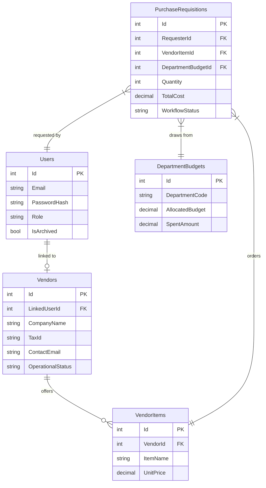

# CCE106/L SECOND LABORATORY EXAM
## Project Proposal, Documentation, & Software Testing Process
**Project Name:** ProVMS (Procurement & Vendor Management System)  
**Role:** Software Engineer  

---

## 📖 PLAIN ENGLISH TERMINOLOGY GUIDE
This guide translates the technical terms used in this document into simple, everyday explanations:

| Technical / Enterprise Term | Simplified Term | Everyday Definition (What it actually means) |
| :--- | :--- | :--- |
| **Purchase Requisition (PR)** | **Purchase Request** | An internal request made by an employee asking for permission to buy something. |
| **Purchase Order (PO)** | **Approved Order Ticket** | The formal, legally-binding document sent to the supplier confirming what the company is buying and at what price. |
| **Budget Encumbering** | **Budget Locking** | Temporarily holding or "freezing" department money when a request is made, so it cannot be spent on anything else while waiting for approval. |
| **RBAC (Role-Based Access Control)** | **Account Permissions** | Controlling what screens and actions a user can access based on their job title (e.g., only Finance can see budgets). |
| **Unit Testing** | **Testing Single Bricks** | Checking if a single, tiny piece of code (like a password security checker) works correctly on its own. |
| **Integration Testing** | **Testing the Plumbing** | Checking if two separate parts of the system talk to each other correctly (like checking if clicking "Buy" successfully freezes the budget). |
| **System Testing** | **Testing the Whole House** | Testing the entire application from start to finish to ensure the complete workflow runs smoothly. |
| **User Acceptance Testing (UAT)** | **The Test Drive** | Having real users (like Finance Managers and Vendors) test the system to confirm it solves their daily work problems. |

---

## 1. Project Proposal & Development

### Bullet 1: Design and propose an application of your choice
* **Proposed Application:** **ProVMS (Procurement & Vendor Management System)**.
* **Problem Statement:** In modern offices, buying goods is slow, paper-heavy, and prone to unapproved spending ("maverick spending"). Departments often exceed their budgets without the finance team knowing until the invoice arrives.
* **Our Solution:** ProVMS is a centralized web portal that simplifies the purchase-to-payment process. It replaces email trails with automated workflows, checks budgets in real-time to block overspending, and tracks suppliers to keep them accountable.

### Bullet 2: The system must integrate at least one emerging technology
We have designed ProVMS to integrate emerging technologies. Below is how each example from your list is integrated or planned:
* **AI (Artificial Intelligence):** 
  * *Implementation:* Automated Document Reading (OCR). When a vendor signs up, they upload their tax registration certificate. An integrated AI model automatically scans the document, reads the text, and extracts their Tax ID and Company Name. This prevents manual typing errors and speeds up registration.
* **Cloud Computing:** 
  * *Implementation:* Containerized Hosting & Automatic Scaling. The application is packaged in a Docker container hosted on cloud networks. If hundreds of employees submit budget requests at the end of the year, the cloud network automatically adds extra virtual servers to handle the load, scaling back down when quiet.
* **IoT (Internet of Things):** 
  * *Implementation:* Logistics Tracking. We plan to connect with delivery truck GPS units to display the live physical location of shipments on the user's transit dashboard.
* **APIs (Application Programming Interfaces):** 
  * *Implementation:* Third-Party Connections & Real-Time Alerts. We use the Google reCAPTCHA API to block automated spam bots at the login page. We also use a lightweight internal API (`/api/Notifications`) that pushes real-time notification alerts to the user's screen without refreshing the page.
* **Cross-platform Frameworks:** 
  * *Implementation:* Responsive Web Engine. The client interface uses a responsive Bootstrap layout that renders correctly across desktop, tablet, and mobile screens, avoiding the need to maintain separate native mobile codebases.

### Bullet 3: Develop a working prototype or a detailed system design
We have developed a functional, database-connected prototype built on **ASP.NET Core 9.0 MVC** and **MySQL**. It features active user logins, real-time budget validation, automatic budget locking, and digital purchase order creation.

---

## 2. Documentation

### Bullet 1: Project Overview (title, objectives, target users)
* **Title:** ProVMS (Procurement & Vendor Management System)
* **Objectives:**
  1. *Financial Governance:* Lock budget funds the moment a request is submitted, instantly blocking any over-budget purchases.
  2. *Process Efficiency:* Allow suppliers to register online and automate order routing from request to delivery.
  3. *Audit Accountability:* Maintain a permanent, unchangeable ledger log of all budget actions to prevent fraud.
* **Target Users:**
  * *System Admin:* Manages user accounts, reviews response logs, and configures system rules.
  * *Finance Manager:* Controls department budgets and approves or rejects financial requests in the queue.
  * *Procurement Officer:* Vets supplier registrations, converts cleared requests to official purchase orders, and downloads PDF receipts.
  * *Internal User (Staff/Requester):* Browses active vendor catalogs, submits order requests, and completes post-delivery evaluations.
  * *Registered Vendor (Supplier):* Registers their company details, manages catalog items, and updates cargo transit logs.

### Bullet 2: System Features and Functionalities
* **Module 1 (Vendor & Administration):** Account creation, accreditation desk vetting, and response-time SLA tracking.
* **Module 2 (Finance Management):** Budget manager, financial approval queues, and append-only audit trail logs.
* **Module 3 (Procurement Operations):** Catalog search, budget-locked purchase requests (PR), PDF purchase order (PO) generation, cargo transit tracker, and 5-star supplier feedback confirmers.

### Bullet 3: Technology Stack (software and hardware)
* **Software Stack:**
  * ASP.NET Core 9.0 MVC
  * Pomelo Entity Framework Core (MySQL provider)
  * MySQL database server
  * BCrypt password hashing
  * iText7 PDF generation engine
  * Bootstrap 5 / JS / jQuery
* **Hardware Stack:**
  * Development Workstation: Multi-core CPU, 8 GB RAM, 256 GB SSD storage.
  * Web hosting server: 1 vCPU, 1 GB RAM, 500 MB database storage.

### Bullet 4: Development Approach / Methodology
We chose the **Agile Scrum framework**, working in **2-week iterations (Sprints)**. This allowed us to build working features (like user logins and budget checks) iteratively and verify them with stakeholders frequently.

### Bullet 5: System Design (diagrams, architecture, UI design if applicable)
* **System Architecture:** 
  The system uses a **Three-Tier Architecture** (Client Browser $\rightarrow$ Web Server $\rightarrow$ Relational Database) and implements the **Model-View-Controller (MVC)** pattern. All business rules (budget clearance) are handled securely on the server to prevent client-side tampering.

```mermaid
flowchart TD
    BrowserClient["Browser Client\n(Bootstrap 5 UI + JS)"] -->|HTTP requests| WebServer["ASP.NET Core Web Server\n(MVC Logic + Auth Controllers)"]
    WebServer -->|Entity Framework Core| DB[MySQL Database\n(Budgets, Orders, Logs)]
```

* **Entity-Relationship Diagram (ERD):**


---

## 3. Software Testing (REQUIRED FOCUS)

### Bullet 1: Types of testing used (unit testing, integration testing, system testing, user acceptance testing)
* **Unit Testing:** Testing single logic blocks in isolation (e.g., verifying BCrypt password hash validation and budget calculation arithmetic).
* **Integration Testing:** Verifying interactions between connected components (e.g., confirming that submitting a requisition successfully triggers the budget lock and inserts a pending approval queue entry).
* **System Testing:** Testing the entire end-to-end procurement cycle (onboarding $\rightarrow$ vetting $\rightarrow$ PR $\rightarrow$ PO $\rightarrow$ transit $\rightarrow$ delivery $\rightarrow$ evaluation).
* **User Acceptance Testing (UAT):** Sandboxed testing by real department coordinators to verify user interface and functional workflows solve daily needs.

### Bullet 2: Testing strategy and approach
* **Incremental Validation:** Testing components immediately as they were completed in each sprint.
* **Boundary Testing:** Inputting negative quantities, exceeding department budgets, and uploading invalid file extensions to verify robust handling.
* **Security Audits:** Reviewing route permissions to ensure unauthorized roles are blocked from entering system screens.

### Bullet 3: Tools (if any)
* **xUnit:** Automated unit tests.
* **Moq:** Mocking database dependencies for fast, isolated test execution.
* **Postman:** Manual API endpoint validation.
* **Chrome DevTools:** Browser interface rendering diagnostics.
* **MySQL Workbench:** Verifying raw database state logs.

---

## 4. Test Cases (MANDATORY)

These test cases cover the core ProVMS workflows in the required table format:

| Test Case ID | Test Description | Input Data | Expected Output | Actual Output | Status |
| :--- | :--- | :--- | :--- | :--- | :--- |
| **TC-01** | Vendor self-onboards using the registration wizard. | Company Name: "TechCorp"<br>File: "tax_certificate.pdf" | Account created; status set to "Pending Verification". | Account created; status is "Pending Verification". | **PASS** |
| **TC-02** | System Admin reviews and vetting. | Vendor ID: TechCorp<br>Action: Click "Approve" | Status updates to "Active"; vendor item catalog becomes visible. | Status updated to "Active"; items now visible in marketplace. | **PASS** |
| **TC-03** | Internal User requests item within budget. | Item: Laptop<br>Cost: Php 50,000<br>Budget: Php 100,000 | Request accepted; status set to "Pending Finance"; budget of Php 50,000 locked. | Request accepted; Php 50,000 locked in database. | **PASS** |
| **TC-04** | Internal User attempts to purchase over-budget item. | Item: Servers<br>Cost: Php 150,000<br>Budget: Php 100,000 | Requisition blocked; displays "Budget Exceeded" error page. | Request blocked; "Budget Exceeded" warning displayed. | **PASS** |
| **TC-05** | Finance Manager reviews and clears request. | PR ID: PR-001042<br>Action: Click "Approve" | Status updates to "Approved Budget"; audit entry written to log database. | Status changed; audit ledger entry verified in database. | **PASS** |
| **TC-06** | Procurement Officer issues PO. | PR ID: PR-001042<br>Action: Click "Issue PO" | Status updates to "PO Issued"; PDF file compiles and downloads. | Status set to "PO Issued"; PDF downloads successfully. | **PASS** |
| **TC-07** | Vendor dispatches cargo. | PO ID: PO-001042<br>Action: Click "Ship" | Status updates to "In Transit"; requester is notified via notification bell. | Status changed to "In Transit"; notification badge updated. | **PASS** |
| **TC-08** | Requester confirms delivery and rates supplier. | PO ID: PO-001042<br>Action: Click "Confirm"<br>Rating: 5 Stars | Status set to "Archived"; locked funds spent permanently; rating saved. | Status is "Archived"; budget deduction confirmed; leaderboard updated. | **PASS** |

***
*ProVMS-IT15 System Engineering Team | Laboratory Exam Documentation Submission*
