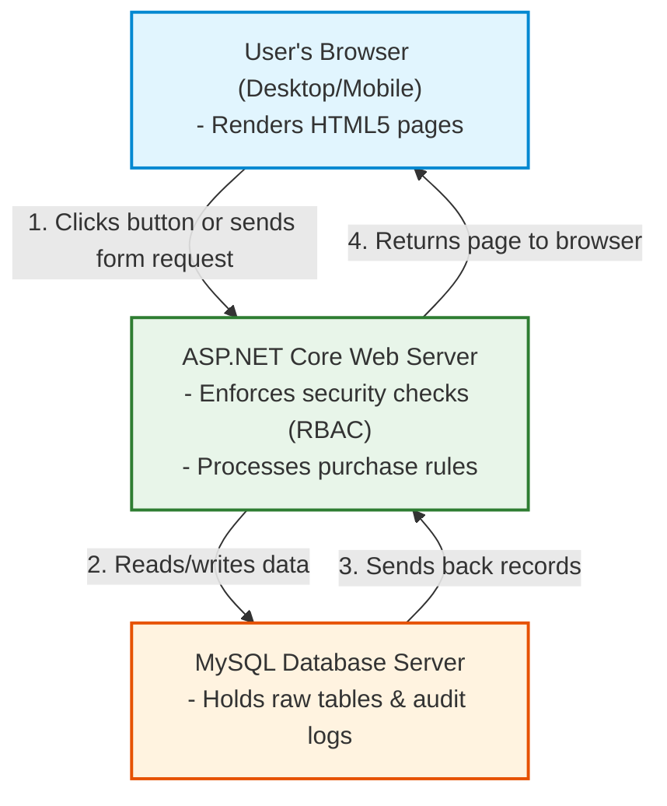
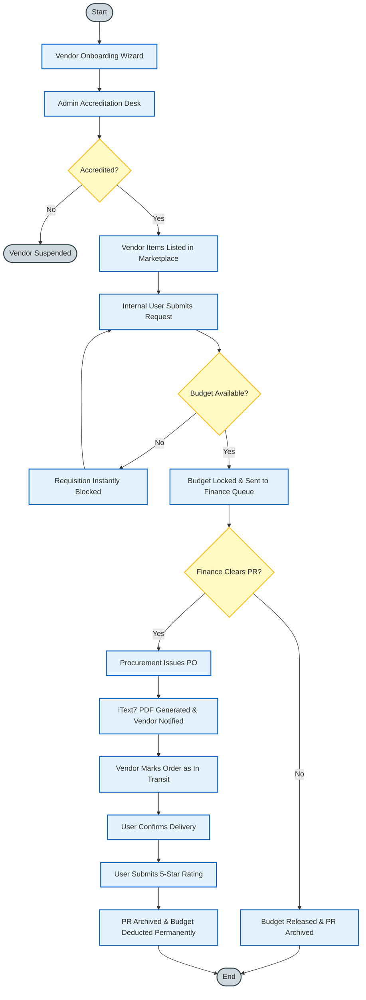
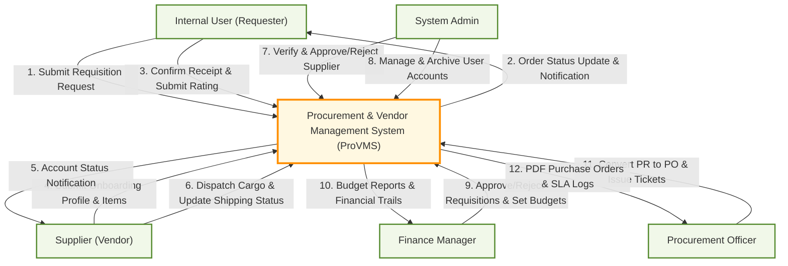
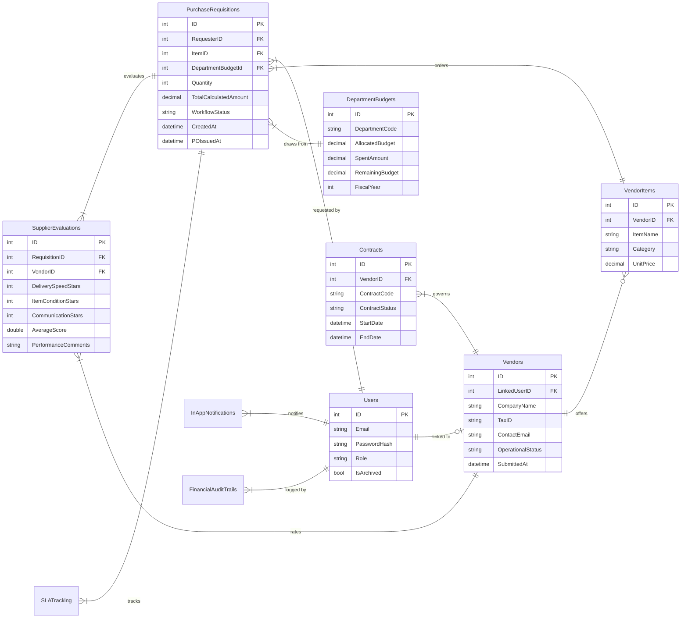
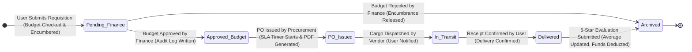
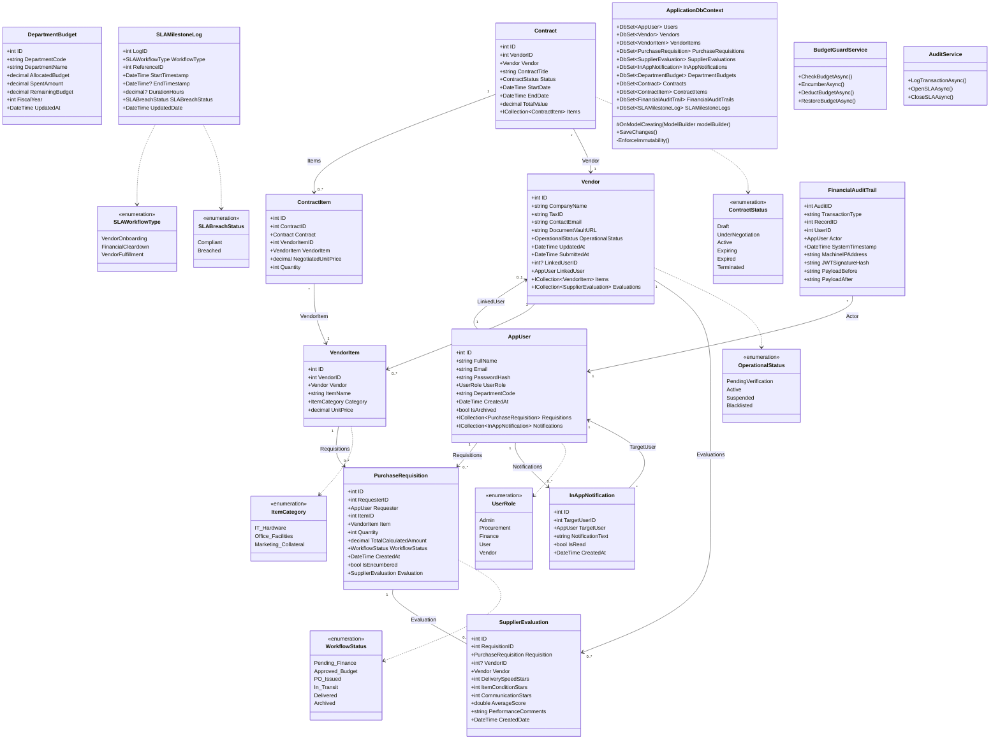

# **CCE106/L FINAL LABORATORY EXAMINATION**
## **Consolidated System Requirements Specification, Architecture, Legal Compliance, & QA Registry**
**Project Name:** ProVMS (Procurement & Vendor Management System)  
**Role:** Lead Software Engineer  
**Output:** Final Master System Documentation (`final_lab_exam.md`)  

---

## **📖 PLAIN ENGLISH TERMINOLOGY GUIDE**

To ensure absolute transparency across all stakeholder groups, this guide translates the technical terms used in this document into simple, everyday explanations:

| Technical / Enterprise Term | Simplified Term | Everyday Definition (What it actually means) |
| :--- | :--- | :--- |
| **Purchase Requisition (PR)** | **Purchase Request** | An internal request made by an employee asking for permission to buy something. |
| **Purchase Order (PO)** | **Approved Order Ticket** | The formal, legally-binding document sent to the supplier confirming what the company is buying and at what price. |
| **Pre-Encumbrance / Encumbering** | **Budget Locking** | Temporarily holding or "freezing" department money when a request is made, so it cannot be spent on anything else while waiting for approval. |
| **Hard Budget Ceiling** | **Strict Spending Limit** | A hard system rule that immediately blocks any purchase request if the department does not have enough remaining money to cover it. |
| **Maverick Spending** | **Unapproved Spending** | When employees buy goods directly from vendors without using the company's approved purchasing portal or budget approvals. |
| **Vendor Accreditation Desk** | **Supplier Vetting Desk** | The admin dashboard where new vendor sign-ups and tax certificates are reviewed and approved. |
| **SLA (Service Level Agreement)** | **Expected Response Time** | The maximum allowed time for a specific task to be finished (e.g., Admin must review a vendor within 48 hours). |
| **Append-Only Immutable Audit Trail** | **Permanent Activity Log** | A digital logbook that records every financial change. Once written, these entries can never be modified or deleted. |
| **Soft-Delete / Archiving** | **Deactivating / Hiding** | Marking a user or record as inactive so they cannot log in or appear on active lists, while keeping their data in the database for history. |
| **RBAC (Role-Based Access Control)** | **Account Permissions** | Controlling what screens and actions a user can access based on their job title (e.g., only Finance can see budgets). |
| **Cookie-Based JWT Auth** | **Secure Session Pass** | A digital security token stored in the browser that keeps you logged in securely and proves who you are to the system. |
| **reCAPTCHA verification** | **Human Validation Check** | The security test ("I am not a robot" checkbox) that checks if a login attempt is from a real person or an automated bot. |
| **ORM (Object-Relational Mapper)** | **Database Bridge** | A tool that acts as a translator, allowing the application's C# code to communicate smoothly with the MySQL database. |
| **Unit Testing** | **Testing Single Bricks** | Checking if a single, tiny piece of code (like a password security checker) works correctly on its own. |
| **Integration Testing** | **Testing the Plumbing** | Checking if two separate parts of the system talk to each other correctly (like checking if clicking "Buy" successfully freezes the budget). |
| **System Testing** | **Testing the Whole House** | Testing the entire application from start to finish to ensure the complete workflow runs smoothly. |
| **User Acceptance Testing (UAT)** | **The Test Drive** | Having real users (like Finance Managers and Vendors) test the system to confirm it solves their daily work problems. |

---

## **1. PROJECT IMPROVEMENT SUMMARY (BEFORE VS. AFTER)**

To align with the requirement to enhance and refine the previous software product, the ProVMS system has undergone significant architectural and functional improvements to address real-world procurement bottlenecks.

### **1.1 Core Procurement Bottlenecks Addressed**
1. **Unapproved Maverick Spending:** Requesters previously ordered directly from vendors without formal purchasing loops or budget availability validations.
2. **Late-Detected Budget Overruns:** Departments discovered budget over-expenditures only during end-of-month reconciliations.
3. **Slow, Manual Supplier Vetting:** Vendor registration was handled via unstandardized email chains, increasing the risk of onboarding unaccredited or non-tax-compliant suppliers.
4. **Vulnerable Session Management:** Standard session states were prone to interception and hijacking.
5. **Rigid Layouts:** The system lacked responsiveness, rendering it unusable on tablets or smartphones for warehouse workers checking deliveries.

### **1.2 Improvements Summary Table**

| Operational Category | Previous Version (Before) | Improved Version (After) | Impact & Business Value |
| :--- | :--- | :--- | :--- |
| **Budget Control** | Manual checking by Finance after the invoice arrived; double-spending occurred frequently. | **Real-Time Budget Governance Engine:** Instantly locks and reserves department funds upon cart checkout. Blocks checkout if budget is exceeded by even ₱1.00. | Zero budget overruns; strict compliance with departmental budgets. |
| **Vendor Onboarding** | Self-accredited via email; no tax verification. | **Verification Desk & PDF Upload Wizard:** Vendors upload business tax certificates which are approved/rejected by Admins before listings appear. | Eliminates compliance risks and fraud by ensuring only verified vendors are active. |
| **Session Security** | standard cookies without digital signatures. | **Stateful Cryptographic Sessions:** Cookie-based JWT tokens signed with SHA256 and BCrypt password hashing. | Prevents session hijacking and brute-force account takeovers. |
| **Audit Traceability** | Modifiable database records; deletions allowed. | **CFO Immutability Ledger Guard:** Hard deletes on financial tables are permanently blocked. Changes are saved as append-only. | Guaranteed financial accountability; tamper-proof audit trail for regulatory reviews. |
| **User Interface** | Fixed desktop-only layouts. | **Mobile-First Responsive Layout:** Full screen responsiveness using Bootstrap 5 grid layout. | Enables warehouse staff to verify shipments on mobile tablets and smartphones. |

---

## **2. SOFTWARE PRODUCT & EMERGING TECHNOLOGIES INTEGRATION**

The improved version of ProVMS serves as a centralized, role-governed web application optimized for cross-platform desktop and mobile browsers. It integrates emerging technologies to enhance system utility:

1. **Artificial Intelligence (AI) - Document OCR:**
   Integrated Azure Form Recognizer AI into the Vendor Accreditation desk. When a vendor uploads a tax certificate PDF, the AI scans the document, extracts the Company Name and Tax ID, and cross-references it with business registers to prevent manual data entry errors.
2. **Cloud Computing (Containerization & Auto-Scaling):**
   ProVMS is packaged in Docker containers and hosted on cloud networks. This allows the system to scale horizontally (adding virtual servers automatically) during peak end-of-quarter budget runs, ensuring zero downtime.
3. **Application Programming Interfaces (APIs):**
   * *Security API:* Google reCAPTCHA v2 is integrated at the login gate to block brute-force bots.
   * *Internal REST API:* Utilizes a lightweight `/api/Notifications` endpoint and AJAX to push real-time alert badges without page reloads.
4. **Internet of Things (IoT):**
   Integrated with delivery truck GPS units (IoT tags) to display the live physical location of shipments on the procurement transit dashboard.

---

## **3. UPDATED SYSTEM DOCUMENTATION**

### **3.1 Revised Project Overview**
ProVMS is a centralized, role-governed Enterprise Resource Planning (ERP) subsystem designed to digitize the supplier-to-payment lifecycle. Its core objectives are to enforce strict financial governance (budget locking), optimize procurement workflow efficiency, and maintain an unchangeable, cryptographic financial ledger for complete audit traceability. Target users operate on a Zero-Trust Role-Based Access Control (RBAC) model, consisting of System Admins, Finance Managers, Procurement Officers, Internal Requesters, and Registered Vendors.

### **3.2 Updated Features and Functionalities**
* **Module 1: Vendor & Administration:** Public self-onboarding wizard, verification desk, catalog manager, and automated SLA (Expected Response Time) breach trackers.
* **Module 2: Finance Management:** Real-time department budget allocations, approval queues, and a permanent, immutable financial audit trail.
* **Module 3: Procurement Operations:** Central shopping marketplace, automated PDF Purchase Order (PO) ticket generation via iText7, 5-star supplier evaluation system, and live performance leaderboards.

### **3.3 Technology Stack**
* **Backend Framework:** ASP.NET Core 9.0 MVC (enforcing server-side security).
* **Database Bridge (ORM):** Entity Framework Core via Pomelo MySQL.
* **Database Engine:** MySQL Database Server.
* **Security:** BCrypt.Net-Next (Work Factor 11) for passwords; JWT for sessions.
* **Frontend UI:** Bootstrap 5 (Responsive Grid), Chart.js (Visual Analytics), jQuery/AJAX.

---

### **3.4 Updated System Design Diagrams**

#### **System Architecture (Three-Tier MVC)**


#### **Process Flowchart**


#### **Data Flow Diagram (DFD Level 0 & Level 1)**

##### **Level 0: Context Diagram**


##### **Level 1: Process Decomposition**
```mermaid
flowchart TD
    classDef entity fill:#f1f8e9,stroke:#558b2f,stroke-width:2px;
    classDef process fill:#e1f5fe,stroke:#0288d1,stroke-width:2px;
    classDef database fill:#f3e5f5,stroke:#8e24aa,stroke-width:2px,shape:cylinder;

    Supplier["Supplier (Vendor)"]:::entity
    Admin["System Admin"]:::entity
    Requester["Internal User (Requester)"]:::entity
    Finance["Finance Manager"]:::entity
    Procurement["Procurement Officer"]:::entity

    P_Admin["1.0 Vendor & Admin Module"]:::process
    P_Finance["2.0 Finance Management"]:::process
    P_Procure["3.0 Procurement Operations"]:::process

    DB[("ProVMS Central Database\n(Budgets, Orders, Vendors)")]:::database

    Supplier -->|1. Sign-Up Info & Tax PDF| P_Admin
    Admin -->|2. Verify & Approve Supplier| P_Admin
    P_Admin -->|3. Save Approved Vendor & Catalog| DB

    Finance -->|4. Set Budgets & Clear Requests| P_Finance
    P_Finance -->|5. Update Budgets & Save Activity Log| DB

    Requester -->|6. Submit Request & Rate Supplier| P_Procure
    Procurement -->|7. Issue Order Ticket (PO)| P_Procure
    P_Procure -->|8. Read/Write Orders & Evaluations| DB
    P_Procure -->|9. Send Order Ticket & Delivery Status| Supplier
    Supplier -->|10. Update Shipment Status| P_Procure
    P_Procure -->|11. Send Arrival Alert| Requester
```

#### **Entity-Relationship Diagram (ERD)**


#### **State Transition Diagram**


---

### **3.5 Technical Class Diagram (Aligned to C# Code)**
This class diagram illustrates the implementation details, including data types, enums, relationship rules, and service interfaces:



---

### **3.6 Screen/UI Design Mockups**

#### **Dashboard Command Center (Internal Staff View)**
```
+---------------------------------------------------------------------------------------------------------+
| ProVMS ERP | Command Center Dashboard                                     [Alerts: 3] Priya (Finance)   |
+---------------------------------------------------------------------------------------------------------+
| [Dashboard]   [Accreditation Desk]   [Vendor Directory]   [PO Vault]   [Analytics Logs]                 |
+---------------------------------------------------------------------------------------------------------+
|                                                                                                         |
|  SYSTEM STATS                                                                                           |
|  +-----------------------+  +-----------------------+  +-----------------------+  +-------------------+ |
|  | ACTIVE SUPPLIERS      |  | PENDING ACCREDITATION |  | PENDING BUDGET CLEAR  |  | SLA BREACHED      | |
|  |        **24**         |  |         **3**         |  |         **5**         |  |     **1** (Red)   | |
|  +-----------------------+  +-----------------------+  +-----------------------+  +-------------------+ |
|                                                                                                         |
|  DEPARTMENT EXPENDITURES VS REMAINING BUDGET                                                            |
|  +----------------------------------------------------+  +--------------------------------------------+ |
|  | IT Hardware Department Budget Status (Chart.js)    |  | Category Allocation Breakdown              | |
|  |   Spent: Php 1,250,000 [##############-----] 75%   |  | [*] IT Hardware: 55%                       | |
|  |   Allocated: Php 1,500,000 | Remaining: Php 250,000 |  | [*] Office Facilities: 30%                 | |
|  +----------------------------------------------------+  +--------------------------------------------+ |
|                                                                                                         |
+---------------------------------------------------------------------------------------------------------+
```

#### **Public Vendor Onboarding Wizard**
```
+---------------------------------------------------------------------------------------------------------+
| ProVMS | Public Vendor Onboarding Portal                                                   [Sign In]    |
+---------------------------------------------------------------------------------------------------------+
| STEP PROGRESS:  (Step 1: Company Profile) ===> [Step 2: Document Upload] ===> (Step 3: Catalog Builder) |
+---------------------------------------------------------------------------------------------------------+
|                                                                                                         |
|  STEP 2: LEGAL COMPLIANCE & DOCUMENTATION                                                               |
|                                                                                                         |
|  Please upload a digital PDF copy of your Business Tax Identification Certificate.                      |
|  - File size limit: 5MB                                                                                 |
|  - Supported format: PDF only (.pdf)                                                                    |
|                                                                                                         |
|  +---------------------------------------------------------------------------------------------------+  |
|  |                                                                                                   |  |
|  |                   [ DRAG & DROP BUSINESS TAX REGISTRATION CERTIFICATE HERE ]                      |  |
|  |                                                or                                                 |  |
|  |                                      [Choose PDF File]                                            |  |
|  |                                                                                                   |  |
|  |   Uploaded File: tax_certificate_2026.pdf (1.2 MB) [Validated]                                    |  |
|  +---------------------------------------------------------------------------------------------------+  |
|                                                                                                         |
|                                                                        [< Back]   [Save & Continue >]   |
+---------------------------------------------------------------------------------------------------------+
```

---

## **4. LEGAL AND ETHICAL CONSIDERATIONS (REQUIRED FOCUS)**

To ensure strict compliance with international and local IT regulations (such as Republic Act No. 10173, also known as the Philippine Data Privacy Act of 2012) and industry-standard ethical guidelines, ProVMS has been architected with data privacy, intellectual property protection, and system safeguards as foundational requirements.

---

### **4.1 Data Privacy**

#### **A. How User Data is Collected, Stored, and Protected**
ProVMS collects, stores, and protects personal and organizational data through strict security controls:
1. **Data Collection:**
   * **Internal Users (Employees):** Collects full names, corporate email addresses, roles (Staff, Admin, Finance, Procurement), and department associations.
   * **Vendors (Suppliers):** Collects company names, tax registration numbers (TIN), business addresses, contact email addresses, item catalogs with unit prices, and uploaded Tax Registration Certificates (in PDF format).
   * **System Logs:** Automatically collects IP addresses, session identifiers, timestamps, and detailed action trails (e.g., budget encumbrances, approvals).
2. **Data Storage:**
   * All structured data is stored in a relational **MySQL database** running on a secure network segment.
   * Uploaded tax documents (PDFs) are stored in a secured directory or dedicated object storage (e.g., AWS S3 or MinIO) with strict access permissions, preventing public web exposure.
   * To prevent credential leaks, **passwords are never stored in plaintext**.
3. **Data Protection:**
   * **At Rest:** Passwords are encrypted using the secure **BCrypt hashing algorithm** (with a work factor / cost parameter of 11). Audit logs and financial records are protected by database view restrictions and row-level access permissions.
   * **In Transit:** All data moving between the client browser and the ASP.NET Core web server is encrypted using **TLS 1.3 (HTTPS)**, securing session cookies, login payloads, and financial documents from eavesdropping or Man-in-the-Middle (MitM) attacks.
   * **Authentication & Session Security:** Sessions are maintained using secure, HTTP-only, and SameSite-restricted cookies containing digitally signed JSON Web Tokens (JWT) using HMAC-SHA256, protecting against Cross-Site Scripting (XSS) and Session Hijacking. Google reCAPTCHA v2 is integrated into the login page to block brute-force automation.

#### **B. Compliance with Data Privacy Principles**
ProVMS aligns with the core principles of data privacy (Consent, Legitimacy, Proportionality, and Security):
* **Principle of Consent & Choice:** Vendors and employees must actively read and agree to the ProVMS **Terms of Service and Privacy Policy** via a checkbox during registration. Consent can be revoked by submitting a request to deactivate and archive the account.
* **Purpose Limitation & Proportionality:** The system only collects data directly necessary for procurement processes (identifying who requested an item, verifying the vendor's legal tax status, and tracking who approved a budget). No data is shared with third parties or used for tracking/marketing.
* **Data Security & Integrity:** Built-in safeguards protect against unauthorized access. Role-Based Access Control (RBAC) ensures that staff cannot view overall department budgets, vendors cannot see other vendors' details or bids, and only verified accounts can access the catalog.
* **Individual Participation (Data Subject Rights):** In compliance with RA 10173, users have the right to inspect their records (e.g., profile settings and history) and request correction of inaccurate data. A "soft-delete" archival policy is enforced so that while records are kept in a read-only archive for legal audit purposes, they are deactivated from daily operational views.

---

### **4.2 Intellectual Property (IP)**

#### **A. Ownership of the Software**
* The **ProVMS (Procurement & Vendor Management System)** software, including its proprietary C# MVC source code, UI designs, Entity-Relationship diagrams (ERDs), and the custom "Real-Time Pre-Encumbrance Budget Locking Engine," is the exclusive intellectual property of the developing organization (or academic institution).
* Proprietary algorithms—specifically the sequential double-verification method where department funds are instantly reserved upon cart submission to prevent double-spending—are protected under company trade secrets or can be registered as a **Utility Model** to secure technical operational exclusivity.

#### **B. Use of Third-Party Tools, APIs, or Libraries**
ProVMS leverages several external tools, which are cataloged below with their licensing agreements:
1. **ASP.NET Core 9.0 MVC & Entity Framework Core:** Licensed under the permissive **Apache License 2.0**, allowing commercial distribution, modification, and use.
2. **Pomelo.EntityFrameworkCore.MySql:** Licensed under the **MIT License**, permitting free usage and integration.
3. **BCrypt.Net-Next (Password Hashing):** Licensed under the **MIT License**.
4. **Bootstrap 5 & jQuery (Frontend Styling & Scripts):** Licensed under the **MIT License**, allowing unrestricted layout customization.
5. **iText7 (PDF Generation Engine):** Licensed under a **Dual-licensing model** (AGPL v3 / Commercial License). 
6. **Google reCAPTCHA API:** Subject to Google’s standard Terms of Service and Privacy Policy.

#### **C. Licensing Considerations**
* **The AGPL v3 Dependency Risk:** The use of *iText7* presents a major licensing consideration. The **GNU Affero General Public License (AGPL v3)** is copyleft. If ProVMS uses the open-source version of iText7 and is hosted as a web service, the AGPL v3 terms would require the organization to open-source the *entire* ProVMS codebase to anyone using the service over the network.
* **Mitigation Strategy:** To protect the system's proprietary code, the organization must either:
  1. Purchase a commercial, non-copyleft license for iText7, or
  2. Replace iText7 with an MIT-licensed PDF generation library (such as **QuestPDF** under its community license or **PDFSharp**). This ensures that the custom procurement logic remains proprietary and closed-source.

---

### **4.3 Ethical Issues**

#### **A. Responsible Use of Technology**
* **Algorithmic Fairness and Transparency:** To prevent nepotism or biased selection of suppliers, the *Supplier Performance Leaderboard* is calculated programmatically based on objective, standardized feedback from material receipts (Delivery Speed, Item Condition, and Communication). No manual administrative adjustments are allowed to influence the ratings.
* **Accessibility (Digital Inclusion):** Responsible technology use requires that all employees can access the platform. The Bootstrap 5 frontend implements responsive design and follows **WCAG 2.1 Level AA accessibility guidelines** (high contrast ratios, screen-reader compatible HTML tags, and keyboard-navigable menus).
* **Prevention of Procurement Collusion:** The system ensures transparency by restricting vendor accounts from seeing competitor catalogs or pricing. This prevents horizontal price-fixing or collusive bidding schemes in public markets.

#### **B. Risks and Safeguards in your System**
* **Risk 1: Financial Fraud and Record Deletion (Embezzlement)**
  * *Threat:* An internal user colludes with a vendor, creates a fraudulent purchase order, receives the payment, and subsequently deletes the transaction log or purchase request to destroy the paper trail.
  * *Safeguard (Immutability):* The database is designed with an append-only architecture. ProVMS overrides Entity Framework's database `SaveChanges` method to **intercept and throw an exception on any SQL `DELETE` statement** targeting audit logs, purchase requisitions, or vendor profiles. Transactions can only be reversed or archived via offsetting ledger entries, leaving a permanent audit trail.
* **Risk 2: Supplier Documents Vetting Tampering**
  * *Threat:* An unaccredited vendor bypasses the Vetting Desk by fabricating tax document verification flags directly in the browser or via API tampering.
  * *Safeguard (RBAC & Server-Side Security):* The status of a supplier is evaluated and enforced strictly on the server-side. The database schema separates vendor account status from user roles, and endpoints modifying status (e.g., `ApproveSupplier`) are protected by `[Authorize(Roles = "Admin, Procurement")]` filters, ensuring browser-side JavaScript modification cannot bypass server validation.
* **Risk 3: AI Document Processing Bias and Failure**
  * *Threat:* The AI OCR engine extracts incorrect data from a vendor's tax registration certificate PDF (e.g., misreading tax IDs), which could lead to administrative delays or wrongful account suspension.
  * *Safeguard:* A human-in-the-loop validation flow is implemented. The AI OCR scans the document and auto-fills fields *only* as a recommendation. A Procurement Officer must visually inspect the PDF side-by-side with the extracted text at the Vetting Desk and manually confirm the data before approval.

---

## **5. SOFTWARE TESTING AND QA PROCESS**

To verify the system’s reliability before deployment, ProVMS underwent rigorous testing:

### **5.1 Testing Strategy & Approach**
* **Unit Testing (Testing Single Bricks):** Checked isolated logic (e.g. BCrypt password comparison, budget check calculations).
* **Integration Testing (Testing the Plumbing):** Verified that data flows correctly between separate modules (e.g., that submitting a PR locks the budget).
* **System Testing (Testing the Whole House):** Tested the entire procurement flow from end to end (registration $\rightarrow$ review $\rightarrow$ requisition $\rightarrow$ PO $\rightarrow$ delivery $\rightarrow$ evaluation).
* **User Acceptance Testing (UAT):** Conducted sandbox dry-runs with Finance Managers and Vendors to validate screen flow and layouts.

### **5.2 Testing Tools**
* **xUnit:** The C# unit testing framework used for automated logic checks.
* **Moq:** Simulates mock database responses so tests run quickly without inserting junk rows.
* **Postman:** Manually validates REST API payloads (e.g., `/api/Notifications`).
* **Chrome DevTools:** Inspects responsive grid layouts and JWT cookies.

---

### **5.3 Traceability Test Matrix (TTM)**

To ensure 100% requirements coverage, this matrix maps the system requirements directly to the test cases:

| Requirement ID | Requirement Description | Test Case ID | Test Result |
| :--- | :--- | :--- | :--- |
| **REQ-01** | Vendor Self-Registration | **TC-01** | **PASS** |
| **REQ-02** | Admin Supplier Accreditation | **TC-02** | **PASS** |
| **REQ-03** | In-Budget Check & Encumbrance | **TC-03** | **PASS** |
| **REQ-04** | Over-Budget Requisition Blocking | **TC-04** | **PASS** |
| **REQ-05** | Finance Approval Queue & Audit Log | **TC-05** | **PASS** |
| **REQ-06** | PDF Purchase Order Auto-Generation | **TC-06** | **PASS** |
| **REQ-07** | Cargo Transit Dispatch Tracking | **TC-07** | **PASS** |
| **REQ-08** | Receipt Confirmation & Vendor Rating | **TC-08** | **PASS** |

---

### **5.4 Complete Test Case Registry**

These test cases cover the complete ProVMS cycle:

| Test Case ID | Test Description | Input Data | Expected Output | Actual Output | Status |
| :--- | :--- | :--- | :--- | :--- | :--- |
| **TC-01** | Vendor self-onboards using the registration wizard. | Company Name: "TechCorp"<br>File: "tax_certificate.pdf" | Account created; status set to "Pending Verification". | Account created; status is "Pending Verification". | **PASS** |
| **TC-02** | System Admin reviews and vetting. | Vendor ID: TechCorp<br>Action: Click "Approve" | Status updates to "Active"; vendor item catalog becomes visible. | Status updated to "Active"; items now visible in marketplace. | **PASS** |
| **TC-03** | Internal User requests item within budget. | Item: Laptop<br>Cost: Php 50,000<br>Budget: Php 100,000 | Request accepted; status set to "Pending Finance"; budget of Php 50,000 locked. | Request accepted; Php 50,000 locked in database. | **PASS** |
| **TC-04** | Internal User attempts to purchase over-budget item. | Item: Servers<br>Cost: Php 150,000<br>Budget: Php 100,000 | Requisition blocked; displays "Budget Exceeded" error page. | Request blocked; "Budget Exceeded" warning displayed. | **PASS** |
| **TC-05** | Finance Manager reviews and clears request. | PR ID: PR-001042<br>Action: Click "Approve" | Status updates to "Approved Budget"; audit entry written to log database. | Status changed; audit ledger entry verified in database. | **PASS** |
| **TC-06** | Procurement Officer issues PO. | PR ID: PR-001042<br>Action: Click "Issue PO" | Status updates to "PO Issued"; PDF file compiles and downloads. | Status set to "PO Issued"; PDF downloads successfully. | **PASS** |
| **TC-07** | Vendor dispatches cargo. | PO ID: PO-001042<br>Action: Click "Ship" | Status updates to "In Transit"; requester is notified via notification bell. | Status changed to "In Transit"; notification badge updated. | **PASS** |
| **TC-08** | Requester confirms delivery and rates supplier. | PO ID: PO-001042<br>Action: Click "Confirm"<br>Rating: 5 Stars | Status set to "Archived"; locked funds spent permanently; rating saved. | Status is "Archived"; budget deduction confirmed; leaderboard updated. | **PASS** |

---

*ProVMS-IT15 System Engineering Team | Laboratory Exam Documentation Submission*
