# ProVMS (Procurement & Vendor Management System)
## System Class Diagram Specifications & Architecture Reference

This document provides a comprehensive, developer-grade specification of the object-oriented structure of the **ProVMS** system. It describes the data models, enums, services, database context, and their corresponding relationships as implemented in the ASP.NET Core C# codebase.

---

## 1. Mermaid.js Class Diagram

Below is the complete class diagram. It illustrates structural components including domain entities, system enums, core helper services, and the database access layer (`ApplicationDbContext`), along with their relationships, multiplicities, and key dependencies.

```mermaid
classDiagram
    direction TB

    %% =========================================================================
    %% SYSTEM ENUMS
    %% =========================================================================
    class UserRole {
        <<enumeration>>
        Admin
        Procurement
        Finance
        User
        Vendor
    }

    class OperationalStatus {
        <<enumeration>>
        PendingVerification
        Active
        Suspended
        Blacklisted
    }

    class ItemCategory {
        <<enumeration>>
        IT_Hardware
        Office_Facilities
        Marketing_Collateral
    }

    class WorkflowStatus {
        <<enumeration>>
        Pending_Finance
        Approved_Budget
        PO_Issued
        In_Transit
        Delivered
        Archived
    }

    class ContractStatus {
        <<enumeration>>
        Draft
        UnderNegotiation
        Active
        Expiring
        Expired
        Terminated
    }

    class SLAWorkflowType {
        <<enumeration>>
        VendorOnboarding
        FinancialCleardown
        VendorFulfillment
    }

    class SLABreachStatus {
        <<enumeration>>
        Compliant
        Breached
    }

    %% =========================================================================
    %% DOMAIN DATA MODELS
    %% =========================================================================
    class AppUser {
        +int ID [PK]
        +string FullName [Required, MaxLength 150]
        +string Email [Required, MaxLength 255, EmailAddress, Unique]
        +string PasswordHash [Required]
        +UserRole UserRole [Required, Default User]
        +string? DepartmentCode [MaxLength 20]
        +DateTime CreatedAt [Default UtcNow]
        +bool IsArchived [Default false]
        +int AccessFailedCount [Default 0]
        +DateTimeOffset? LockoutEnd
        +ICollection~PurchaseRequisition~ Requisitions
        +ICollection~InAppNotification~ Notifications
    }

    class Vendor {
        +int ID [PK]
        +string CompanyName [Required, MaxLength 200]
        +string TaxID [Required, MaxLength 50, Unique]
        +string ContactEmail [Required, MaxLength 255, EmailAddress]
        +string? DocumentVaultURL [MaxLength 500]
        +OperationalStatus OperationalStatus [Default PendingVerification]
        +DateTime UpdatedAt [Default UtcNow]
        +DateTime SubmittedAt [Default UtcNow]
        +DateTime? ApprovedAt
        +int? LinkedUserID [FK]
        +AppUser? LinkedUser
        +ICollection~VendorItem~ Items
        +ICollection~SupplierEvaluation~ Evaluations
    }

    class VendorItem {
        +int ID [PK]
        +int VendorID [FK]
        +Vendor Vendor [Required]
        +string ItemName [Required, MaxLength 200]
        +ItemCategory Category [Required]
        +decimal UnitPrice [Required, decimal 12,2]
        +ICollection~PurchaseRequisition~ Requisitions
    }

    class PurchaseRequisition {
        +int ID [PK]
        +int RequesterID [FK]
        +AppUser Requester [Required]
        +int ItemID [FK]
        +VendorItem Item [Required]
        +int Quantity [Required, Range 1..Max]
        +decimal TotalCalculatedAmount [Required, decimal 12,2]
        +WorkflowStatus WorkflowStatus [Default Pending_Finance]
        +DateTime CreatedAt [Default UtcNow]
        +DateTime? FinanceSubmittedAt
        +DateTime? ApprovedAt
        +DateTime? POIssuedAt
        +bool IsEncumbered [Default false]
        +SupplierEvaluation? Evaluation
    }

    class SupplierEvaluation {
        +int ID [PK]
        +int RequisitionID [FK, Unique]
        +PurchaseRequisition Requisition [Required]
        +int? VendorID [FK]
        +Vendor? Vendor
        +int DeliverySpeedStars [Required, Range 1..5]
        +int ItemConditionStars [Required, Range 1..5]
        +int CommunicationStars [Required, Range 1..5]
        +double AverageScore [NotMapped]
        +string? PerformanceComments [MaxLength 1000]
        +DateTime CreatedDate [Default UtcNow]
    }

    class InAppNotification {
        +int ID [PK]
        +int TargetUserID [FK]
        +AppUser TargetUser [Required]
        +string NotificationText [Required, MaxLength 500]
        +bool IsRead [Default false]
        +DateTime CreatedAt [Default UtcNow]
    }

    class DepartmentBudget {
        +int ID [PK]
        +string DepartmentCode [Required, MaxLength 20, UniqueIndex]
        +string DepartmentName [Required, MaxLength 100]
        +decimal AllocatedBudget [Required, decimal 15,2]
        +decimal SpentAmount [Required, decimal 15,2, Default 0]
        +decimal RemainingBudget [NotMapped]
        +int FiscalYear [Default CurrentYear]
        +DateTime UpdatedAt [Default UtcNow]
    }

    class Contract {
        +int ID [PK]
        +int VendorID [FK]
        +Vendor? Vendor
        +string ContractTitle [Required]
        +ContractStatus Status [Default Draft]
        +DateTime StartDate
        +DateTime EndDate
        +decimal TotalValue [decimal 15,2]
        +decimal DiscountPercent [decimal 5,2]
        +string? NegotiationNotes
        +DateTime CreatedAt [Default UtcNow]
        +ICollection~ContractItem~ Items
    }

    class ContractItem {
        +int ID [PK]
        +int ContractID [FK]
        +Contract? Contract
        +int VendorItemID [FK]
        +VendorItem? VendorItem
        +decimal NegotiatedUnitPrice [decimal 12,2]
        +int Quantity
        +string CurrencyCode [Default PHP]
    }

    class FinancialAuditTrail {
        +int AuditID [PK]
        +string TransactionType [Required, MaxLength 50]
        +int RecordID
        +int UserID [FK]
        +AppUser? Actor
        +DateTime SystemTimestamp [Default CURRENT_TIMESTAMP]
        +string MachineIPAddress [Required, MaxLength 45]
        +string JWTSignatureHash [Required, MaxLength 255]
        +string? PayloadBefore
        +string? PayloadAfter
    }

    class SLAMilestoneLog {
        +int LogID [PK]
        +SLAWorkflowType WorkflowType [Required]
        +int ReferenceID
        +DateTime StartTimestamp [Default CURRENT_TIMESTAMP]
        +DateTime? EndTimestamp
        +decimal? DurationHours [decimal 6,2]
        +SLABreachStatus SLABreachStatus [Default Compliant]
        +DateTime UpdatedDate [Default CURRENT_TIMESTAMP]
    }

    %% =========================================================================
    %% DATA CONTEXT LAYER
    %% =========================================================================
    class ApplicationDbContext {
        +DbSet~AppUser~ Users
        +DbSet~Vendor~ Vendors
        +DbSet~VendorItem~ VendorItems
        +DbSet~PurchaseRequisition~ PurchaseRequisitions
        +DbSet~SupplierEvaluation~ SupplierEvaluations
        +DbSet~InAppNotification~ InAppNotifications
        +DbSet~DepartmentBudget~ DepartmentBudgets
        +DbSet~Contract~ Contracts
        +DbSet~ContractItem~ ContractItems
        +DbSet~FinancialAuditTrail~ FinancialAuditTrails
        +DbSet~SLAMilestoneLog~ SLAMilestoneLogs
        #OnModelCreating(ModelBuilder modelBuilder)
        +SaveChanges()
        +SaveChangesAsync(CancellationToken token)
        -EnforceImmutability()
    }

    %% =========================================================================
    %% HELPER SERVICES
    %% =========================================================================
    class BudgetGuardService {
        -ApplicationDbContext _db
        +CheckBudgetAsync(string departmentCode, decimal amount) Task~ValueTuple~
        +EncumberAsync(string departmentCode, decimal amount) Task~ValueTuple~
        +DeductBudgetAsync(string departmentCode, decimal amount) Task
        +RestoreBudgetAsync(string departmentCode, decimal amount) Task
    }

    class AuditService {
        -ApplicationDbContext _db
        -IHttpContextAccessor _http
        +LogTransactionAsync(string type, int recId, object before, object after) Task
        +OpenSLAAsync(SLAWorkflowType type, int refId) Task
        +CloseSLAAsync(SLAWorkflowType type, int refId, decimal limitHours) Task
        -GetUserId(HttpContext ctx) int
        -GetClientIp(HttpContext ctx) string
        -GetJwtHash(HttpContext ctx) string
    }

    class JwtService {
        -IConfiguration _config
        +GenerateToken(AppUser user) string
        +ValidateToken(string token) ClaimsPrincipal?
    }

    class NotificationService {
        -ApplicationDbContext _db
        +SendAsync(int targetUserId, string text) Task
        +SendToRoleAsync(UserRole role, string text) Task
    }

    class PdfService {
        +GeneratePurchaseOrder(PurchaseRequisition req) byte[]
    }

    class RecaptchaService {
        -IHttpClientFactory _httpFactory
        -string _secretKey
        -IHttpContextAccessor _httpContext
        +VerifyAsync(string token) Task~bool~
    }

    %% =========================================================================
    %% RELATIONSHIPS & ASSOCIATIONS
    %% =========================================================================
    AppUser "1" --> "0..*" PurchaseRequisition : Requisitions
    AppUser "1" --> "0..*" InAppNotification : Notifications
    
    Vendor "0..1" <-- "1" AppUser : LinkedUser (LinkedUserID -> ID)
    Vendor "1" --> "0..*" VendorItem : Items
    Vendor "1" --> "0..*" SupplierEvaluation : Evaluations
    
    VendorItem "1" --> "0..*" PurchaseRequisition : Requisitions
    
    PurchaseRequisition "1" -- "0..1" SupplierEvaluation : Evaluation
    
    InAppNotification "*" --> "1" AppUser : TargetUser (TargetUserID -> ID)
    
    Contract "*" --> "1" Vendor : Vendor
    Contract "1" --> "0..*" ContractItem : Items
    ContractItem "*" --> "1" VendorItem : VendorItem
    
    FinancialAuditTrail "*" --> "1" AppUser : Actor (UserID -> ID)
    
    %% DbContext Dependencies
    ApplicationDbContext ..> AppUser : manages
    ApplicationDbContext ..> Vendor : manages
    ApplicationDbContext ..> VendorItem : manages
    ApplicationDbContext ..> PurchaseRequisition : manages
    ApplicationDbContext ..> SupplierEvaluation : manages
    ApplicationDbContext ..> InAppNotification : manages
    ApplicationDbContext ..> DepartmentBudget : manages
    ApplicationDbContext ..> Contract : manages
    ApplicationDbContext ..> ContractItem : manages
    ApplicationDbContext ..> FinancialAuditTrail : manages
    ApplicationDbContext ..> SLAMilestoneLog : manages

    %% Service Dependencies
    BudgetGuardService ..> ApplicationDbContext : queries
    AuditService ..> ApplicationDbContext : logs
    NotificationService ..> ApplicationDbContext : updates

    %% Enum Usages (Dependency)
    AppUser ..> UserRole
    Vendor ..> OperationalStatus
    VendorItem ..> ItemCategory
    PurchaseRequisition ..> WorkflowStatus
    Contract ..> ContractStatus
    SLAMilestoneLog ..> SLAWorkflowType
    SLAMilestoneLog ..> SLABreachStatus
```



---

## 2. Detailed Class Specifications

### 2.1 Core Entities (Models)

#### `AppUser`
Represents an internal employee (Requester, Admin, Finance, Procurement) or a Vendor contact account.
* **ID (`int`):** Primary key.
* **FullName (`string`):** The display name. Annotated with `[Required]`, limit 150 characters.
* **Email (`string`):** Login email. Unique index enforced at DB level. Verified with `[EmailAddress]` annotation.
* **PasswordHash (`string`):** Stores securely hashed credentials (using BCrypt).
* **UserRole (`UserRole`):** Controls RBAC authorization. Represented as a string enum in the DB.
* **DepartmentCode (`string?`):** Links users to a specific budget group (e.g., "IT", "HR").
* **CreatedAt (`DateTime`):** Account creation date. Defaults to `DateTime.UtcNow`.
* **IsArchived (`bool`):** Used to support soft-deletion (hiding accounts from standard queries).
* **AccessFailedCount / LockoutEnd:** Manage security credentials and temporary account locks.
* **Navigation Collections:**
  * `Requisitions`: Requisitions requested by this user.
  * `Notifications`: Bell alerts directed to this user.

#### `Vendor`
Represents an accredited or vetting-stage external supplier.
* **ID (`int`):** Primary Key.
* **CompanyName (`string`):** Required, max length 200 characters.
* **TaxID (`string`):** Business tax identification code. Unique index enforced at DB level (max length 50).
* **ContactEmail (`string`):** Primary email address, validated via `[EmailAddress]`.
* **DocumentVaultURL (`string?`):** Path to uploaded accreditation PDFs (e.g., business licenses) inside the storage repository.
* **OperationalStatus (`OperationalStatus`):** Track vetting stages (`PendingVerification`, `Active`, `Suspended`, `Blacklisted`).
* **LinkedUserID (`int?`):** Optional Foreign Key referencing `AppUser`. Allows a vendor account user to manage catalogs and order lists.
* **Navigation Collections:**
  * `Items`: Product items supplied by this vendor.
  * `Evaluations`: Historic evaluations this vendor has received.

#### `VendorItem`
Represents a specific product catalog item offered by a supplier.
* **ID (`int`):** Primary Key.
* **VendorID (`int`):** Foreign Key pointing to the owning `Vendor` record (Cascade Delete behavior).
* **ItemName (`string`):** Required, max length 200 characters.
* **Category (`ItemCategory`):** Categorization enum mapped to string (`IT_Hardware`, `Office_Facilities`, `Marketing_Collateral`).
* **UnitPrice (`decimal`):** Stored as database type `decimal(12,2)`. Represents the base cost of a single unit.

#### `PurchaseRequisition`
Represents an internal purchase request mapping to the ordering process.
* **ID (`int`):** Primary Key.
* **RequesterID (`int`):** Foreign Key referencing `AppUser` (Restrict Delete).
* **ItemID (`int`):** Foreign Key referencing `VendorItem` (Restrict Delete).
* **Quantity (`int`):** Amount ordered (Range constraint: `1` to `int.MaxValue`).
* **TotalCalculatedAmount (`decimal`):** Database column type `decimal(12,2)`. Stores `Quantity * UnitPrice` at the time of submission.
* **WorkflowStatus (`WorkflowStatus`):** Track progression (`Pending_Finance` $\rightarrow$ `Approved_Budget` $\rightarrow$ `PO_Issued` $\rightarrow$ `In_Transit` $\rightarrow$ `Delivered` $\rightarrow$ `Archived`).
* **IsEncumbered (`bool`):** Flag indicating if the requisition cost is currently locked in the department budget.

#### `SupplierEvaluation`
A post-delivery rating filled out by the requester.
* **ID (`int`):** Primary Key.
* **RequisitionID (`int`):** Foreign Key referencing `PurchaseRequisition`. Unique index enforces a **One-to-One** relationship.
* **VendorID (`int?`):** Foreign Key linking to the evaluated `Vendor` (SetNull Delete).
* **DeliverySpeedStars / ItemConditionStars / CommunicationStars (`int`):** Scores ranging from 1 to 5. Constrained via SQL check constraints.
* **AverageScore (`double`):** Calculated dynamically (NotMapped field) as the average of the three-axis star inputs.
* **PerformanceComments (`string?`):** Max length 1000 characters.

#### `DepartmentBudget`
Allocated department capital trackers validated in real-time.
* **ID (`int`):** Primary Key.
* **DepartmentCode (`string`):** Max length 20. Enforces a compound unique index with `FiscalYear` to prevent double-entries.
* **AllocatedBudget (`decimal`):** Mapped to `decimal(15,2)`.
* **SpentAmount (`decimal`):** Mapped to `decimal(15,2)`. Deducts from remaining balance immediately upon pre-encumbrance.
* **RemainingBudget (`decimal`):** Calculated dynamically (NotMapped) as `AllocatedBudget - SpentAmount`.
* **FiscalYear (`int`):** Mapped year (e.g. 2026).

#### `Contract` & `ContractItem`
Govern legal terms, custom negotiated prices, and item scopes agreed with a specific vendor.
* **Contract Properties:** `ID`, `VendorID` (FK), `ContractTitle`, `Status` (ContractStatus), `StartDate`, `EndDate`, `TotalValue`, `DiscountPercent`.
* **ContractItem Properties:** `ID`, `ContractID` (FK), `VendorItemID` (FK), `NegotiatedUnitPrice`, `Quantity`, `CurrencyCode` ("PHP").

#### `FinancialAuditTrail`
Cryptographic ledger documenting structural updates.
* **AuditID (`int`):** Primary Key.
* **TransactionType (`string`):** Action identifier (e.g., "BUDGET_ENCUMBER", "PR_APPROVED"). Max length 50.
* **UserID (`int`):** Foreign Key referencing the user who triggered the action.
* **SystemTimestamp (`DateTime`):** Server timestamp of execution.
* **MachineIPAddress (`string`):** Mapped IPv4/IPv6 client address. Max length 45.
* **JWTSignatureHash (`string`):** SHA256 signature hash extracted from the user's active cookie session.
* **PayloadBefore / PayloadAfter (`string?`):** Raw JSON dumps capturing the database states before and after execution.

#### `SLAMilestoneLog`
SLA log keeping track of turnaround limits.
* **LogID (`int`):** Primary Key.
* **WorkflowType (`SLAWorkflowType`):** Processes (`VendorOnboarding`, `FinancialCleardown`, `VendorFulfillment`).
* **DurationHours (`decimal?`):** Elapsed decimal hours from `StartTimestamp` to `EndTimestamp`.
* **SLABreachStatus (`SLABreachStatus`):** Marked `Breached` if the duration exceeds the threshold limits.

---

### 2.2 System Enums

* **`UserRole`:** `Admin` (0), `Procurement` (1), `Finance` (2), `User` (3), `Vendor` (4).
* **`OperationalStatus`:** `PendingVerification`, `Active`, `Suspended`, `Blacklisted`.
* **`ItemCategory`:** `IT_Hardware`, `Office_Facilities`, `Marketing_Collateral`.
* **`WorkflowStatus`:** `Pending_Finance`, `Approved_Budget`, `PO_Issued`, `In_Transit`, `Delivered`, `Archived`.
* **`ContractStatus`:** `Draft`, `UnderNegotiation`, `Active`, `Expiring`, `Expired`, `Terminated`.
* **`SLAWorkflowType`:** `VendorOnboarding`, `FinancialCleardown`, `VendorFulfillment`.
* **`SLABreachStatus`:** `Compliant`, `Breached`.

---

### 2.3 Core Services (Business Logic Interface)

1. **`BudgetGuardService`:**
   * `CheckBudgetAsync(string departmentCode, decimal amount)`: Validates if remaining funds are sufficient.
   * `EncumberAsync(string departmentCode, decimal amount)`: Locks funds dynamically and updates budget spent.
   * `DeductBudgetAsync(string departmentCode, decimal amount)`: Registers the locked funds as spent permanently.
   * `RestoreBudgetAsync(string departmentCode, decimal amount)`: Releases locked funds (on PR rejection).
2. **`AuditService`:**
   * `LogTransactionAsync(...)`: Serializes before/after payloads and logs a new immutable trail record.
   * `OpenSLAAsync(...)` / `CloseSLAAsync(...)`: Manage milestone clocks and evaluate threshold violations.
3. **`JwtService`:**
   * `GenerateToken(AppUser user)`: Signs user claims (ID, email, role, department) using HMacSha256.
   * `ValidateToken(string token)`: Asserts signatures against the configured issuer and key.
4. **`PdfService`:**
   * `GeneratePurchaseOrder(PurchaseRequisition req)`: Uses the `iText7` API to structure and compile PDF sheets.
5. **`RecaptchaService`:**
   * `VerifyAsync(string token)`: Verifies reCAPTCHA submission against Google's endpoint (bypassed on localhost).

---

## 3. Relational Plumbing & EF Core Constraints

Relationships are configured within `ApplicationDbContext.cs` inside `OnModelCreating(ModelBuilder modelBuilder)`.

### 3.1 Foreign Key Delete Behaviors
* **`VendorItem` $\rightarrow$ `Vendor` (`Cascade`):** Deleting a Vendor automatically purges all their catalog entries.
* **`PurchaseRequisition` $\rightarrow$ `Requester` (`Restrict`):** Block deletion of users who have requested purchases to preserve financial history.
* **`PurchaseRequisition` $\rightarrow$ `VendorItem` (`Restrict`):** Block deletion of catalog items linked to purchase histories.
* **`SupplierEvaluation` $\rightarrow$ `PurchaseRequisition` (`Cascade`):** Removing a requisition removes its associated rating form.
* **`SupplierEvaluation` $\rightarrow$ `Vendor` (`SetNull`):** Deleting a vendor leaves the numeric ratings intact (for ledger consistency), but breaks the link back to the deleted vendor entity.
* **`InAppNotification` $\rightarrow$ `TargetUser` (`Cascade`):** Deleting a user profile purges their inbox history.

### 3.2 CFO Immutability Ledger Guard
To prevent unauthorized deletion of transactions, `ApplicationDbContext.cs` overrides both `SaveChanges()` and `SaveChangesAsync()` to block deletion attempts on financial tables.

```csharp
private void EnforceImmutability()
{
    var forbidden = ChangeTracker.Entries()
        .Where(e => e.State == EntityState.Deleted &&
                    (e.Entity is FinancialAuditTrail ||
                     e.Entity is PurchaseRequisition ||
                     e.Entity is Contract ||
                     e.Entity is ContractItem))
        .ToList();

    if (forbidden.Count > 0)
    {
        var typeName = forbidden.First().Entity.GetType().Name;
        throw new InvalidOperationException(
            $"CFO IMMUTABILITY VIOLATION: Deletion of '{typeName}' records is permanently prohibited. " +
            "Financial ledger entries are append-only.");
    }
}
```
This forces developers to use soft-deletes (updating `IsArchived` or setting statuses to `Archived`) instead of deleting records from the database.
