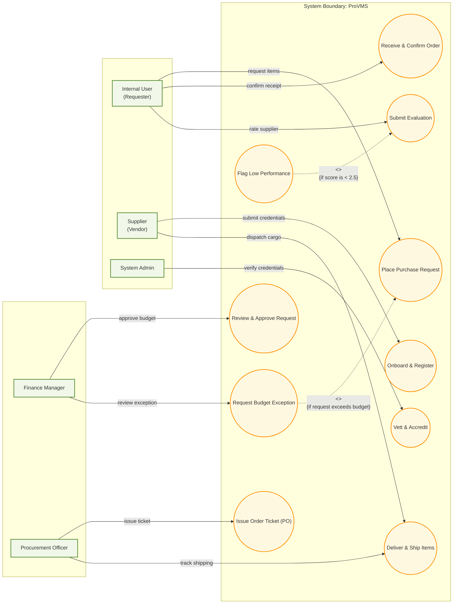

# ProVMS (Procurement & Vendor Management System) — UML Use Case Diagram

This document contains a structured UML Use Case Diagram representing the core modules and actor interactions in the system, modeled after standard association-labeled UML diagrams.

---

## 1. Actors & Interactions Overview
*   **Internal User (Requester):** Initiates purchase requests, confirms order receipts, and rates performance.
*   **Supplier (Vendor):** Onboards with tax credentials and handles cargo dispatch/shipping.
*   **System Admin:** Verifies supplier accreditation details.
*   **Finance Manager:** Reviews and authorizes department expenditures.
*   **Procurement Officer:** Converts approved requests into official purchase order tickets.

---

## 2. Diagram Code (Mermaid.js)

Below is the Mermaid.js source code depicting the use cases, actors, and labeled associations. You can copy this block and paste it directly into any Mermaid editor to render it visually.

